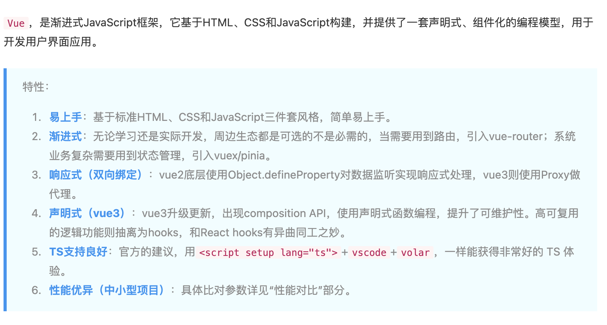

## 问题

### 自我介绍

面试官您好
我叫柴源，也可以叫我的英文名 Emma，我毕业于重庆交通大学，学的是通信工程专业，拥有四年的前端开发工作经验。
在之前的工作当中主要使用的技术栈是 Vue，有一些 Taro+react 开发微信小程序的经验，
最近做的项目是私人承接的，使用的是 Taro+react，主要是做了一个万年历小程序，里面包含了黄历 天气、吉日查询，紫薇排盘等功能，目前还在内测中，微信小程序还没有接入，这个项目我负责了整个项目的开发工作，从项目搭建，到页面的开发，到接口的对接，都是我一个人完成的，这个项目我也是第一次接触 Taro+react，所以在开发过程中也遇到了很多问题，比如 Taro 的坑，比如 Taro 的一些组件
在我的上一份工作中，负责游戏中心管理平台项目，黑鲨商城重构项目，还有一些内部项目的开发工作，公共项目比如权限管理，组件库的搭建等  
也会负责前端的需求分配，还会参与前端招聘等前端组工作
以上是我的自我介绍，谢谢。

### 遇到过什么问题，怎么解决的

### 满意的项目

### 职业规划

### 缺点

### 了解公司问题

1. 技术栈
2. 团队规模
3. 工作内容

### 怎么解释空窗期

1. 回家 9-10
2. 学车 11-3
3. 接活 4-5（一个多月）
   项目搭建-（2）
   登陆-1
   权限系统
   用户管理-增删改查
   角色管理-增删改查，角色权限管理（项目增删改查，
   部门管理
   8 页面（12）

   项目管理-增删改查（2 页-3） 项目状态，项目指派，项目成员
   需求管理（3 页-5）
   我的需求
   新增需求
   需求详情
   需求编辑

4. 万年历，节日详情，黄历，紫薇历，星测模型，命例库，新增/修改命例，排盘，我的（我的资料，登陆，反馈，问题，详情），天气，吉日查询，吉日详情，黄历详情
   (进度-内测中，微信小程序还没有接入)

### 模拟面试

## Vue 和 React 对比

### react Hooks 和 Vue3 组合式 API 的区别

react 问题：
不必要的渲染，影响性能
React 使用 useMemo，这也需要传入正确的依赖数组 ；Vue 使用 watch 和 conputed 自动收集计算属性和侦听器的依赖，因此无需手动声明依赖
传递给子组件的事件处理函数会导致子组件进行不必要的更新。Vue 则不用

### React 和 Vue 的区别，怎么选

根据业务特性

- 根据团队适用性、业务适用性、技术生态

  

  ·

引出：

1. 数据劫持
2. observer 观察者
3. 什么是双向数据绑定，怎么实现

### MVC

m-model
v-view
c-controller

### 响应式和双向绑定理解

响应式一般指：数据改变驱动视图改变，是单向的
双向绑定：是双向的，视图反过来也可以改变数据。也就是说响应式是双向绑定的一环

### Vue 的特点

MVVM 1.渐进式框架 2.响应式 3.组件化 4.声明式 5.虚拟 DOM

### 声明式和命名式

命名式：每一步的过程都要写成代码，例如改数据后，把 dom 节点的文本改变
声明式：直接改变数据，无需关注数据怎么在页面上更新

### 权限管理

- 登录
- 访问权限：登录才可以访问，
  beforeEach
- 页面权限：
  动态路由 router.addRoute()
- 按钮权限:权限列表，根据权限列表判断是否显示按钮，可以用指令实现

//动态路由
router.addRoute

## JS

### js 语言设计的优点和缺点

JavaScript 可以看作是 ECMAScript、DOM 和 BOM 的集合。

1. ECMAScript：这是 JavaScript 的核心，定义了语言的语法和基本对象。

2. Document Object Model (DOM)：这是一个平台和语言中立的接口，允许程序和脚本动态地访问和更新文档的内容、结构和样式。

3. Browser Object Model (BOM)：允许 JavaScript 与浏览器进行交互。

优点：

1. 脚本语言，在浏览器可以直接运行，不需要编译，可以直接在浏览器运行，方便开发者快速开发和调试
2. 弱类型语言，不需要声明变量类型，代码编写更灵活，但是也容易导致错误
3. 跨平台特性，可以在多环境运行，包括浏览器、服务器、 移动端
4. 强大的客户端交互性能。因为它能够直接嵌入 HTML 和 CSS，因此可以轻松地实现动态交互效果，增强用户体验。
5. 扩展性 各种可重用的库和框架

缺点：

1. 兼容性问题。不同的浏览器支持不同的 JavaScript 版本和功能
2. 在浏览器可以直接运行，也容易受到恶意攻击，例如跨站点脚本攻
3. 性能问题，例如在处理大量数据或要求极高的计算方面
4. 弱类型语言，但是也容易导致错误

### call aply bind

改变 this 的指向，call 可以直接写多个参数，apply 需要用数组方式传递
call、 aply 立即执行 ，bind 返回一个函数，需要调用才会执行
option1:this
call 、bind 可以传递多个参数，aply 多个参数用数组方式传递

### Map 和 Set 的区别

Set 类似于数组，但是成员的值都是唯一的，没有重复的值，可以用来数组去重
Map 键值对的集合，键可以是任何值，Object 的键只可以是字符串
Map 的键值对是有序的，Object 的键值对是无序的

### 宏任务和微任务/事件循环

同步和异步：
同步：在主线程上排队执行的任务，只有前一个任务执行完毕，才能执行后一个任务
异步：不进入主线程，而进入任务队列的任务，主线程任务执行完毕会从任务队列中调用一个异步任务进入主线程执行，

先同步任务再异步任务
异步任务分为宏任务和微任务，先微任务最后宏任务
同步任务>微任务>宏任务

宏任务 ：宏任务的时间粒度比较大，执行的时间间隔是不能精确控制的，对一些高实时性的需求就不太符合
1、定时器任务： 如 setTimeout、setInterval
2、I/O 任务：例如网络请求、文件读写等需要进行 I/O 操作的任务
3、用户交互任务：例如点击事件、输入事件等与用户交互的相关任务
4、渲染任务：当浏览器需要重绘或重新布局时触发的任务

微任务：一个需要异步执行的函数，执行时机是在主函数执行结束之后、当前宏任务结束之前
Promise.then()、await 后面的代码、MutationObserver 回调：当 DOM 发生变化时触发的回调函数

宏任务里的异步任务怎么执行的：
宏任务执行完毕后，会检查微任务队列，如果有微任务，就会执行微任务，直到微任务队列为空，然后再执行下一个宏任务

事件循环：事件循环的机制确保了 JavaScript 中异步代码的顺序性和可预测性。

```js
console.log('script start');

setTimeout(function () {
  console.log('setTimeout');
  Promise.resolve().then(function () {
    console.log('promise3');
  });
  setTimeout(function () {
    console.log('setTimeout1');
  }, 0);
}, 0);
setTimeout(function () {
  console.log('setTimeout2');
  Promise.resolve().then(function () {
    console.log('promise4');
  });
  setTimeout(function () {
    console.log('setTimeout3');
  }, 0);
}, 0);
Promise.resolve()
  .then(function () {
    console.log('promise1');
  })
  .then(function () {
    console.log('promise2');
  });

console.log('script end');
//script start
//script end
//promise1
//promise2
// setTimeout
//promise3
// setTimeout2
// promise4
//setTimeout1
// setTimeout3
```

### 深浅拷贝

实现深拷贝：创建一个新的对象，然后递归地复制原始对象的所有嵌套对象和元素，而不仅仅是复制它们的引用
JSON.stringfy 缺点不能拷贝函数

```js
const originObj = {
  a: 1,
  b: [1, 2, [3, 4, [5]]],
  c: {
    d: 1,
    e: { f: 'a' }
  },
  g: function () {
    console.log('g');
  }
};

const deepClone = obj => {
  if (typeof obj !== 'object' || obj == null) return obj;
  let newObj;
  if (typeof obj == 'function') {
    newObj = obj;
  } else {
    //数组或对象
    newObj = Array.isArray(obj) ? [] : {};
    for (let key in obj) {
      if (obj.hasOwnProperty(key)) {
        //不是原型链上继承的属性
        newObj[key] = deepClone(obj[key]);
      }
    }
  }

  return newObj;
};
console.log(deepClone(originObj));
```

实现浅拷贝：浅拷贝是指创建一个新对象，然后将原始对象的元素（或引用）复制到新对象中，但是新对象中的元素仍然是对原始对象元素的引用。浅拷贝只会复制原始对象的一层结构，而不会递归复制嵌套对象的内部结构。  
1.扩展运算符
2.Object.assign

### 作用域：定义了变量作用范围的一套规则，它决定了代码区块中变量的可见性

es6 之前，作用域是由函数来决定的；es6 之后，新增了块级作用域
作用域分为全局作用域和局部作用域
全局作用域：在代码的任何地方都能访问
局部作用域：在函数内部访问变量

通过函数内部的函数

闭包不一定会有 return
闭包有可能造成内存泄漏，但是不是一定

```js
function outer() {
  const a = 1;
  function inner() {
    console.log(a);
  }
  inner();
}
```

### 垃圾回收机制

垃圾产生：创建一个基本类型、对象、函数……都是需要占用内存的，内存由浏览器的引擎分配，当不再使用这些内存时，就需要将其释放掉，这些不再使用的内存就是垃圾

JavaScript 垃圾回收机制的原理就是定期找出那些不再用到的内存（变量），然后释放其内存

- 标记清除算法

1. 垃圾收集器在运行时会给内存中的所有变量都加上一个标记，假设内存中所有对象都是垃圾，全标记为 0
2. 然后从各个根对象开始遍历，把不是垃圾的节点改成 1
3. 清理所有标记为 0 的垃圾，销毁并回收它们所占用的内存空间
4. 最后，把所有内存中对象标记修改为 0，等待下一轮垃圾回收

缺点：会导致内存空间不连续碎片化

- 引用计数算法

1.  当声明了一个变量并且将一个引用类型赋值给该变量的时候这个值的引用次数就为 1
2.  如果同一个值又被赋给另一个变量，那么引用数加 1
3.  如果该变量的值被其他的值覆盖了，则引用次数减 1
4.  当这个值的引用次数变为 0 的时候，说明没有变量在使用，这个值没法被访问了，回收空间，垃圾回收器会在运行的时候清理掉引用次数为 0 的值占用的内存
    缺点：需要计数器；如果变量之间互相引用，不会被回收，可能会造成内存泄漏

- V8 优化 分代式垃圾回收
  分为老生代和新生代
  新生代：存活时间短，垃圾回收频繁
  老生代：占用空间大，存活时间长的，垃圾回收不频繁，采用标记清除算法
  新生代分为：使用区和空闲区，
  使用区，当使用区快被写满时，就需要执行一次垃圾清理操作

### CSS

### 重绘和回流

重绘：当渲染树中的一些元素需要更新属性，而这些属性只是影响元素的外观、风格，而不会影响布局的操作，比如 background-color。此时浏览器会将新的样式重新绘制一遍，这个过程称为重绘

回流：当渲染树中的一部分（或全部）因为元素的规模尺寸、布局、隐藏等改变而需要重新构建的过程，这个过程称为回流

怎么减少重绘和回流：

1. 使用 transform 替代 top
2. 使用 visibility 替换 display: none，因为前者只会引起重绘，后者会引发回流（改变了布局）
3. 将动画效果应用到 position 属性为 absolute 或 fixed 的元素上，避免影响其他元素的布局，这样只是一个重绘，而不是回流
4. 避免频繁操作样式，最好一次性重写 style 属性，或者将样式列表定义为 class 并一次性更改 class 属性
5. 使用离线 DOM：创建一个 documentFragment，在它上面应用所有 DOM 操作，最后再把它添加到文档中
6. 避免频繁操作 DOM，将多个操作合并为一个或者使用 documentFragment

### flex

常用于响应式设计和移动端开发中，弹性布局，灵活的分配空间和对齐方式，避免 float 布局的一些问题

flex-basis:length|auto 默认 auto，不计入剩余空间
auto：元素本身宽度
length：元素设置的 width 不再生效

flex: flex-grow flex-shrink flex-basis
flex:auto 元素宽度+分配剩余空间
flex:1 1 auto

flex:1 不缩放，分配剩余空间 width 不生效
flex:1 1 0%

flex:0 不展示
flex:0 1 0%

flex:none 元素本身宽度，不会放大缩小
flex:0 0 auto

flex 只设置 flex-basis，flex-grow flex-shrink 默认 1 1
只设置 flex-grow flex-shrink ，flex-basis 为 0%

align-self: auto | flex-start | flex-end | center | baseline | stretch;
auto 继承父元素属性

### BFC 块级格式化上下文

指的是一个独立的渲染区域，让块级盒子在布局时遵循一些特定的规则。BFC 的存在使得我们可以更好地控制文档流，处理浮动、清除浮动等问题。

BFC 的形成条件包括：

1. 浮动元素（元素的 float 不是 none）
2. 绝对定位元素（元素的 position 为 absolute 或 fixed）
3. 行内块元素（元素的 display 为 inline-block）
4. 表格单元格（元素的 display 为 table-cell）
5. 表格标题（元素的 display 为 table-caption）
6. overflow 值不为 visible 的块元素

BFC 的应用场景包括：
1、清除浮动：
当一个容器内部有浮动元素时，如果没有给容器创建 BFC，那么容器的高度将无法被撑开，导致一些问题，如边框或背景不显示、文字环绕等。可以通过在容器上创建 BFC 来解决这个问题，例如可以将容器的 overflow 设置为 hidden。
ps：清除浮动的方法还有其他，如给父元素设置一定的高度;浮动元素后增加一个元素设置 clear:both

2、避免 margin 重叠：
当两个相邻的盒子都设置了 margin 时，它们之间的距离将会是两者 margin 中较大的一个，而不是将两者相加。如果将其中一个盒子放入一个 BFC 中，可以避免 margin 重叠的问题。

3、实现多栏布局：
通过创建 BFC，可以将容器划分为独立的区域，在这些区域内布局，从而实现多栏布局。

4、防止浮动元素遮盖：
比如清除文字环绕，图片设置 float，文字会环绕图片，如果不想文字环绕，可以给文字设置 BFC，

5、防止父子元素外边距塌陷
父元素设置 overflow:hidden

## 性能优化

1. 减小代码体积-webpack 打包优化
2. 减少重绘和回流
3. 编码习惯
4. 缓存
5. 图片
6. 懒加载
7. 预加载，按需加载
8. 网络优化，减少请求次数，合并请求，减少请求大小

#### 浏览器从输入 URL 到页面渲染的过程

1. 浏览器根据 DNS 服务器得到域名的 IP 地址
   域名解析： 浏览器缓存->系统缓存->路由器缓存->ISP DNS 缓存->根域名服务器  
   优化点：CDN
2. 向这个 IP 的机器发送 HTTP 请求
3. 服务器收到、处理并返回 HTTP 请求
4. 浏览器得到返回内容
5. 浏览器进行 HTML 解析，建立 DOM 树
6. 浏览器进行 CSS 解析，建立 CSSOM 树
7. 将 DOM 和 CSSOM 组合成一个渲染树
8. 如果遇到 script 标签，会执行并阻塞渲染
9. 根据渲染树来布局，计算每个节点的位置
10. 调用 GPU 绘制，合成图层，显示在屏幕上
11. 监听事件，执行绑定的回调函数

#### 网络

TCP/IP 网络协议
TCP 连接 3 次握手 四次挥手

http1.0 http1.1 http2.0=>  
keep-alive 保持 tcp 连接，不用反复创建连接
http2.0=>多路复用，一个连接可以并发多个请求，解决了队头阻塞问题->chrome 最多同时发送 6 个请求

状态： http 无状态，TCP 有状态
TCP 优化点：socket 连接，封装 TCP，方便应用和调用？？？？

SSL 安全协议
https 加密传输，会延长连接时间
优化： 和并请求 + 长连接

#### 浏览器缓存

HTTP 缓存分为强缓存和协商缓存

强缓存请求头：

expires ：源指定缓存到期 GMT 的绝对时间
cache-control：弥补 Expires 的缺陷而加入的，
Cache-Control 优先级高于 Expires
max-age：缓存的最大有效时间，单位秒
no-cache：不使用本地缓存，需要使用协商缓存
no-store：不缓存，使用协商缓存

协商缓存请求头：
last-modified (if-modified-since) -> http 1.0
Etag(if-none-match) -> http 1.1

last-modified
浏览器在请求服务器资源时，服务器会将文件的最后修改时间，赋值给相应求头 last-modified
Etag
Etag 其实和 last-modified 的效果一样，都是后端针对相应的资源，返回的一个标识，只是 last-modified 是资源最后的修改时间，etag 是资源相应的标识，不同的服务器生成 etag 的策略是不一样的

etag 为什么会优先于 last-modified

浏览器缓存的工作流程：

1. 浏览器首先检查资源的内存缓存，如果资源存在于内存中且未过期，就会直接使用它。

2. 如果资源不在内存缓存中，浏览器会检查磁盘缓存，如果资源存在于磁盘缓存中且未过期，就会加载并存储到内存缓存中，然后使用。

3. 如果资源既不在内存缓存也不在磁盘缓存中，浏览器会向服务器发出请求来获取资源。

4. 服务器返回资源后，浏览器会根据响应头的缓存控制信息来存储资源到内存缓存和磁盘缓存中，以备将来使用。

#### web 服务器

服务器软件：apache、nginx

处理请求：  
反向代理：传递到其他服务器  
域名解析：

- 通过前端控制并发数量

```js
const max = 10;
const urlArr = new Array(20).fill(0).map((item, index) => index);
//封装发送请求的服务
const serve = url => {
  return new Promise((resolve, reject) => {
    // 模拟发送请求
    setTimeout(() => {
      resolve(url);
    }, url * 100);
  });
};
//执行发送请求
const run = fn => {
  fn.then(res => {
    console.log(res);
    if (urlArr.length) {
      const _url = urlArr.shift();
      run(serve(_url));
    }
  });
};
const justiposition = (max, urlArr) => {
  for (let i = 0; i < max; i++) {
    const _url = urlArr.shift();
    run(serve(_url));
  }
};
justiposition(max, urlArr);
```

## 安全

1. 跨站脚本攻击（XSS）：

问题： 攻击者注入恶意脚本到网页，用户浏览网页时执行该脚本。
建议： 使用 CSP（内容安全策略）来限制允许加载的资源，对用户输入进行输入验证和转义，不信任的数据不应该被直接插入 HTML。

2. 跨站请求伪造（CSRF）：

问题： 攻击者诱使用户在未经许可的情况下执行意外的操作，例如更改密码或提交表单。
建议： 使用 CSRF 令牌来验证请求的合法性，不要在 GET 请求中执行敏感操作。

3. 内容安全策略（CSP）：

问题： 如果 CSP 配置不当，它可能会导致网页加载的资源受到限制，甚至阻止合法的资源加载。
建议： 配置 CSP 以仅允许受信任的资源加载，进行定期检查和测试以确保不会影响网站功能。

4. 点击劫持：
   问题： 攻击者通过透明覆盖在网页上的可点击区域欺骗用户，以执行未经许可的操作。
   建议： 使用 Frame Busting 技术或 X-Frame-Options 来防止网页被嵌套到恶意站点中。
5. 不安全的依赖：

问题： 使用不安全、过期或有漏洞的第三方依赖库。
建议： 定期更新和审查依赖库，仅使用可信赖的库，了解其安全性。

6. 敏感数据泄露：
   问题： 未加密的敏感数据在传输中泄露，或者敏感信息存储在前端代码中。
   建议： 使用 HTTPS 来加密数据传输，不要将敏感信息存储在前端，遵循数据保护法规。

7. 不安全的存储：
   问题： 在本地存储（LocalStorage、SessionStorage）中存储敏感信息，容易被窃取。
   建议： 避免在本地存储中存储敏感数据，使用 Cookie 和服务器端存储代替。

8. 安全标头：
   问题： 未配置安全 HTTP 头（如 X-Content-Type-Options、X-XSS-Protection、Strict-Transport-Security 等）。
   建议： 配置适当的 HTTP 头以增强网站的安全性。

9. 敏感信息在 URL 中：

问题： 在 URL 中传递敏感信息，如密码或会话标识。
建议： 避免在 URL 中传递敏感信息，使用 POST 请求和安全的身份验证方法。

10. 文件上传漏洞：

问题： 允许用户上传恶意文件，可能导致服务器漏洞。
建议： 对用户上传的文件进行验证和筛选，不要直接执行上传的文件。

## 跨域

## 异步引入 js 的方式

## 模块化面试问题

1. 请解释一下 JavaScript 的模块化以及它的重要性。
   拆分文件->方便维护，命名空间->避免命名冲突，按照功能拆分->复用
2. 请解释 CommonJS、AMD、UMD 和 ES6 模块的区别。
   CommonJS：node.j 规范，同步加载，就近依赖，可按需加载
   AMD：浏览器环境规范，异步加载，依赖前置
   UMD：使得一个模块可以在多种环境运行，兼容 AMD 和 CommonJS
   ES6：ES6 引入的规范，静态导入和导出，只能在顶层使用，不可以在代码块或函数中导入
3. 如何在浏览器中使用 CommonJS 模块？
   打包工具
4. 请解释一下 `require`、`exports`、`module.exports` 在 Node.js 中的作用。
   require：导入，但会一个模块的 exports 对象
   exports 和 module.exports：导出
5. 请解释一下 `import` 和 `export` 在 ES6 模块中的作用。
6. 请解释一下动态导入 (`import()`) 在 ES6 模块中的作用和使用场景。
   运行时动态导入：使得可以按需加载
7. 如何将一个 CommonJS 模块转换为 ES6 模块？
   module.exports -> export
   require -> import
8. 请解释一下循环依赖是什么，以及如何解决循环依赖的问题。
   a 依赖 b，b 依赖 a
   ？？？？ 解决：避免或者使用异步导入，
9. 请解释一下 JavaScript 的模块加载器和打包工具，例如 RequireJS、Browserify、Webpack 等。
   都是用来管理和打包 JS 模块的工具

## 日志/打点

收集前端错误警告： 以 Vue 为例
收集接口错误：响应拦截器，统一处理报错

### webpack

## 实现登录 验证码

复制粘贴
验证码一个格子一个格子的输入
扫二维码登录=>

## Vue 组件库的封装/组件库的发布
