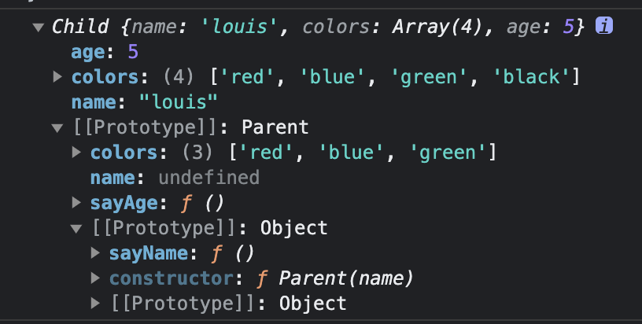

## 问题

### 自我介绍

面试官您好
我叫柴源，也可以叫我的英文名 Emma，我毕业于重庆交通大学，学的是通信工程专业，拥有四年的前端开发工作经验。
在之前的工作当中主要使用的技术栈是 Vue，有一些 Taro+react 开发微信小程序的经验
在我的上一份工作中，负责游戏中心管理平台项目，黑鲨商城重构项目，还有一些内部项目的开发工作，公共项目比如权限管理，组件库的搭建等  
也会负责分配前端工作给团队成员，还会参与招聘工作和信任培养
以上是我的自我介绍，谢谢。

### 遇到过什么问题，怎么解决的

上一份工作：

上一个项目：
开发过程中会遇到很多问题
生态环境不是很完善，
echats 的使用，官方文档上面的在 H5，找了很久物料市场，找到了一个，
还会有一些问题，比如 canvas，creactCanvas 在小程序有问题，得用另一种方式，
最快的方法直接在 github issue 上面找

### 职业规划

### 缺点

### 了解公司问题

### 怎么解释空窗期

1. 回家 9-10
2. 学车 11-3
3. 接活 4-5（一个多月）
   项目搭建-（2）
   登陆-1
   权限系统
   用户管理-增删改查
   角色管理-增删改查，角色权限管理（项目增删改查，
   部门管理
   8 页面（12）

   项目管理-增删改查（2 页-3） 项目状态，项目指派，项目成员
   需求管理（3 页-5）
   我的需求
   新增需求
   需求详情
   需求编辑

4. 万年历，节日详情，黄历，紫薇历，星测模型，命例库，新增/修改命例，排盘，我的（我的资料，登陆，反馈，问题，详情），天气，吉日查询，吉日详情，黄历详情
   (进度-内测中，微信小程序还没有接入)

## Vue

问题：  
1.Vue3 响应式原理  
2.Vue2/VVue3 diff 差分算法

### Vue3 比 Vue2 的更新

1.响应式实现方式，Object.defineProperty 改为 Proxy  
2.增加组合式 API  
3.生命周期 beforeDestroy 改为 beforeUnmount,destroyed 改为 unmounted,  
 组合式 API 没有 beforeCreate 和 created 生命周期，在 setup 函数中调用可以实现相同的功能  
4.删除了过滤器  
5.改变 v-for 和 v-if 的优先级，改为 v-if 优先级比 v-for 高  
6.减小代码体积，tree-shaking，只打包使用到的代码  
7.增加静态标记，标记静态节点，diff 算法时，只对动态节点进行比较  
8.Teleport 组件
Fragments 片段
Emits 组件选项\*\*

### react Hooks 和 Vue3 组合式 API 的区别

react 问题：  
不必要的渲染，影响性能
React 使用 useMemo，这也需要传入正确的依赖数组 ；Vue 使用 watch 和 conputed 自动收集计算属性和侦听器的依赖，因此无需手动声明依赖
传递给子组件的事件处理函数会导致子组件进行不必要的更新。Vue 则不用

### React 和 Vue 的区别，怎么选

根据业务特性

- 根据团队适用性、业务适用性、技术生态

  

  ·

### MVVM

首先，MVVM 是一种框架设计模式
MVVM 是 Model - View - ViewModle 的缩写
Model 代表数据模型
View 代表视图
ViewModel 通过双向数据绑定，实现 Model 和 View 的交互

补充：
ViewModel 监听到数据改变，更新视图，监听用户操作视图，然后通知数据做改动
这使得开发者只需关注业务逻辑，不需要手动操作 DOM，页不需要关注数据状态的同步问题

引出：  
1.数据劫持  
2.observer 观察者  
3.什么是双向数据绑定，怎么实现

### MVC

> > > > > > > >

m-model
v-view
c-controller

### SPA

单页面应用 single page application
实际上只有一个 html 文件，这个 html 文件提供挂载点，浏览器解析执行代码，生成真实的 DOM 渲染到挂载点

缺点：
不利于 SEO ，搜索引擎获取不到页面信息 --SSR+CSR 服务端渲染，可以只首屏 SSR 渲染 ，vue 的 NustJs；静态页面预渲染，适合静态页面
所有代码都一起渲染，首屏时间较长--相应的渲染完之后，页面之间的切换页面加载很快--可以异步加载

### 双向数据绑定原理->如何实现数据劫持

Vue2.x  
Object.defineProperty

双向绑定实现视图改变，数据也改变；数据改变，视图也改变
通过事件监听，来监听视图的操作，对应的改变数据
Object.defineProperty( )数据劫持来监听数据的改变，如何更新对应的视图，即如何找到对应的节点

监听器 Observer，用来监听所有数据--> 通知订阅者 Watcher 看是否需要更新
解析器 Compile，对每个节点元素进行扫描和解析，将相关指令对应初始化成一个订阅者 Watcher，并替换模板数据，绑定更新函数，添加监听数据的订阅者

实现一个监听器 Observer，用来劫持并监听所有属性，如果有变动的，就通知订阅者。  
实现一个订阅者 Watcher，可以收到属性的变化通知并执行相应的函数，从而更新视图。  
实现一个解析器 Compile，可以扫描和解析每个节点的相关指令，并根据初始化模板数据以及初始化相应的订阅器。

> > > > > > > >

Vue3.x
Proxy

### 响应式和双向绑定理解

响应式一般指：数据改变驱动视图改变，是单向的
双向绑定：是双向的，视图反过来也可以改变数据。也就是说响应式是双向绑定的一环

### Vue2.x 如何监听数组变化

Vue2.x 中实现检测数组变化的方法，是将数组的常用方法进行了重写。Vue 将 data 中的数组进行了原型链重写，指向了自己定义的数组原型方法。这样当调用数组 api 时，可以通知依赖更新。如果数组中包含着引用类型，会对数组中的引用类型再次递归遍历进行监控。这样就实现了监测数组变化

当利用索引直接设置一个数组项时，  
当通过 length 属性直接赋值修改数组的长度时  
Vue2.x 的方式无法监听到，Vue2.x 解决方法$set、splice

### v-model 实现

Vue2.x：v-model 默认会利用名为 value 的 prop 和名为 input 的事件
Vue3.x:

> > > > > > > >

### diff 差分算法

统计比较，  
1.判断 标签名称一样就继续比较，不一样就直接替换  
2.一样，新旧节点是否相等，相等就跳过，不相等就继续比较  
3.文本节点，就用新文本替换旧文本；旧没有子节点，新的有子节点，新增子节点；旧有子节点，新的没有子节点，删除子节点；都有子节点，就对比子节点  
4.对比子节点用到了双指针算法，新旧节点头尾各一个指针，四种情况，新头和旧头，新尾和旧尾，新头和旧尾，新尾和旧头，


> > > > > > > >

### nextTick 的作用是什么？原理是什么？

Vue 不是数据更新就立刻更新视图，而是异步更新，nextTick 的作用就是在下次 DOM 更新循环结束之后执行延迟回调，用于获取更新后的 DOM  
原理：
nextTick 的原理是利用了微任务和宏任务的原理，
将数据变更放入一个队列中，只在下一个事件循环中进行更新，避免同步更新可能引发的性能问题和 UI 闪烁现象。

vue 更新 DOM 是异步更新的，数据变化，DOM 的更新不会马上完成，nextTick 的回调是在下次 DOM 更新循环结束之后执行的延迟回调。

> > > > > > > >

### Vue 组件的 data 为什么必须是函数

Vue 组件的 data 为什么必须是函数？
因为组件是可以复用的，如果 data 是对象，那么组件复用时，data 会被共享，一个组件的数据改变，其他组件的数据也会改变，所以 data 必须是函数，每个组件实例都可以维护一份被返回对象的独立的拷贝

### Vue 的特点

MVVM 1.渐进式框架  
2.响应式  
3.组件化  
4.声明式  
5.虚拟 DOM

### 声明式和命名式

命名式：每一步的过程都要写成代码，例如改数据后，把 dom 节点的文本改变
声明式：直接改变数据，无需关注数据怎么在页面上更新

### 虚拟 DOM

虚拟 DOM 是一个对象用来描述 真实 DOM 树
只重新渲染需要更新的 DOM 节点，性能更好

直接真实 DOM

### 组件化

合理的组件拆分
提高复用度
只更新

### 生命周期钩子

组合式 API ：

钩子的概念：在程序运行中，在特定的位置，通过注册一个回调函数进行相关业务代码的编写

onMounted：  
 组件完成挂载。同步子组件都已经被挂载，  
 其自身的 DOM 树已经创建完成并插入了父容器中  
 可以进行 DOM 操作，更改数据不会触发 onUpdated

onUpdated：  
 响应式数据更改， DOM 树更新后调用；  
 父组件的更新钩子将在其子组件的更新钩子之后调用  
 要注意的是避免在此期间更改数据，因为这可能会导致无限循环的更新。

onUnmounted：  
 组件实例被卸载后调用；  
 子组件实例已被卸载，自身创建的计算属性和侦听器都已停止运行  
 进行定时器、DOM 事件监听器副作用清除操作

onBeforeMount：  
 在组件实例挂载之前，已完成响应式设置，但 DOM 节点 还没创建

onBeforeUpdate：
响应式状态已改变，还没更新 DOM 树

onBeforeUnmount：  
组件卸载之前，组件实例还保有全部功能

> > onErrorCaptured  
> > onRenderTracked：开发模式下可用  
> > onRenderTriggered：开发模式下可用  
> > onActivated：若组件实例是 <KeepAlive> 缓存树的一部分，当组件被插入到 DOM 中时调用。  
> > onDeactivated：若组件实例是 <KeepAlive> 缓存树的一部分，当组件从 DOM 中被移除时调用。  
> > onServerPrefetch：注册一个异步函数，在组件实例在服务器上被渲染之前调用；仅会在服务端渲染中执行，用于执行一些仅存在于服务端的数据抓取过程

选项式 API

beforeCreate：  
组件实例创建之后调用，在当前阶段 data、methods、computed 以及 watch 上的数据和方法都不能被访问。

created：  
在实例创建完成后发生，当前阶段已经完成了响应式数据、计算属性、方法和侦听器设置，也就是可以使用数据，更改数据，  
在这里更改数据不会触发 updated 函数。  
可以做一些初始数据的获取，在当前阶段无法与 DOM 进行交互，如果非要想，可以通过 vm.$nextTick 来访问 DOM 。

beforeMount：发生在组件挂载之前，在这之前 template 模板已导入渲染函数编译。而当前阶段虚拟 DOM 已经创建完成，即将开始渲染。在此时也可以对数据进行更改，不会触发 updated。

mounted：在组件挂载完成后发生，在当前阶段，真实的 DOM 挂载完毕，数据完成双向绑定，可以访问到 DOM 节点，使用 $refs 属性对 DOM 进行操作。

beforeUpdate：发生在 DOM 更新之前，也就是响应式数据发生更新，虚拟 DOM 重新渲染之前被触发，你可以在当前阶段进行更改数据，不会造成重渲染。

updated：发生在更新完成之后，当前阶段组件 DOM 已完成更新。要注意的是避免在此期间更改数据，因为这可能会导致无限循环的更新。

beforeDestroy：发生在实例销毁之前，在当前阶段实例完全可以被使用，可以做一些清除副作用的工作，比如清除计时器。

destroyed：发生在实例销毁之后，这个时候只剩下了 DOM 空壳。组件已被拆解，数据绑定被卸除，监听被移出，子实例也统统被销毁。

### 子组件和父组件的生命周期钩子执行顺序，子组件先还是父组件先

组件的调用顺序都是先父后子，渲染完成的顺序是先子后父。组件的销毁操作是先父后子，销毁完成的顺序是先子后父。

加载渲染过程：父 beforeCreate->父 created->父 beforeMount->子 beforeCreate->子 created->子 beforeMount- >子 mounted->父 mounted

子组件更新过程：父 beforeUpdate->子 beforeUpdate->子 updated->父 updated

父组件更新过程：父 beforeUpdate -> 父 updated

销毁过程：父 beforeDestroy->子 beforeDestroy->子 destroyed->父 destroyed

### 组合式 API 和选项式 API 区别

选项式 API：组件实例提供了一系列的选项如 methd，computed，watch 来实现组件的逻辑， this 指向当前组件实例，
组合式 API：不需要考虑 this 指向，逻辑更好的复用，灵活的代码组织

- 对比：
  选项式 API 代码逻辑比较分散，组合式 API 代码高聚合，低耦合，逻辑清晰便于维护  
   组合式 API 可以更好的利用编辑器的类型推断，便于代码重用  
   组合式 API 可以更好的支持 TypeScript  
   抽取逻辑,选项式 API 需要用 mixins，组合式 API 可以直接抽取逻辑到函数中或者创建钩子函数

  mixin 命名必须是唯一的不可重复
  组合函数没有这个问题

### setup 什么时候执行

setup() 钩子会在所有选项式 API 钩子之前调用，包括 beforeCreate

### keep-alive

页面缓存

### 路由 Hash 和 History 原理

hash 模式：  
hashChange 事件，监听 hash 值的变化，根据 hash 值的变化，来渲染对应的组件

history 模式：
监听 history.pushState()，history.replaceState()，history.popState() 事件，根据当前的 url 渲染对应的组件

### 路由导航守卫

全局路由
beforeEach：全局前置守卫  
beforeResolve：全局解析守卫  
afterEach：全局后置守卫  
路由配置守卫  
beforeEnter：路由独享守卫
组件内守卫  
beforeRouteEnter：路由进入前守卫  
beforeRouteUpdate：路由更新前守卫  
beforeRouteLeave：路由离开前守卫


### VueX

专为 Vue 提供的状态管理器，VueX 的数据是全局可以访问，  
Vue 组件内创建的的数据都只在当前组件内可以访问，父子组件间也有 props 等方法进行数据传递，也是单向的，为复杂的组件间数据交互提供了解决方法  
store：存储状态 state
改变数据需要调用 commit 方法触发 mutation，mutation 是同步的
如果想要添加异步逻辑，可以通过调用 dispatch 方法，触发 action，action 可以包含任意异步操作，但是还是要通过 commit 方法触发 mutation 改变 state  
getter 相当于计算属性，可以对 state 进行处理，返回新的数据

## JS

### js 语言设计的优点和缺点

优点：

1. 脚本语言，在浏览器可以直接运行，不需要编译，可以直接在浏览器运行，方便开发者快速开发和调试
2. 弱类型语言，不需要声明变量类型，代码编写更灵活，但是也容易导致错误
3. 跨平台特性，可以在多环境运行，包括浏览器、服务器、 移动端
4. 强大的客户端交互性能。因为它能够直接嵌入 HTML 和 CSS，因此可以轻松地实现动态交互效果，增强用户体验。
5. 扩展性 各种可重用的库和框架

缺点：

1. 兼容性问题。不同的浏览器支持不同的 JavaScript 版本和功能
2. 在浏览器可以直接运行，也容易受到恶意攻击，例如跨站点脚本攻
3. 性能问题，例如在处理大量数据或要求极高的计算方面
4. 弱类型语言，但是也容易导致错误

### 原型 原型链 继承

原型：引用对象都有一个 prototype 属性，指向一个对象，这个对象就是原型对象，
原型对象中有一个 constructor 属性，指向函数本身

原型链：原型对象中有一个\_\_proto\_\_属性，指向上一级原型对象(Object.prototype)，这样就形成了一条链，就是原型链,原型链的尽头是 null

继承：利用原型让一个引用类型继承另一个引用类型的属性和方法

- 原型继承
  B 继承 A，重写原型对象，代之以一个新类型的实例
  B 的原型对象 \_\_proto\_\_ A 的原型对象
  A 的实例\_\_proto\_\_A 的原型对象

```
  function A(){
    this.name='a'
  }
  A.prototype.getName=function(){
    console.log(this.name)
  }
  function B(){
    this.name='b'
  }
  B.prototype=new A()
  const instance=new B()
  instance.getName()//b
  //是b不是a的原因，定义构造函数B的时候把属性name重写了，这也是原型继承的缺点，多个实例对引用类型的操作会被篡改。

```

- 构造函数继承
  不使用原型，父类的构造函数来增强子类实例，等同于复制父类的实例给子类

  ```
  function Parent(){
    this.name='parent'
  }
  function Child(){
    Parent.call(this)
  }

  const instance1 = new Child()
  instance1.name='child'
  const instance2 = new Child()
  console.log(instance2.name)//parent
  // 多个实例对引用类型的操作不会被篡改
  //只能继承父类的实例属性和方法，不能继承原型属性/方法
  //无法实现复用，每个子类都有父类实例函数的副本，影响性能

  ```

  - 组合继承
    结合原型链继承和构造函数继承

  ```
    function Parent(name){
      this.name=name
      this.colors = ["red","blue","green"];
    }
    Parent.prototype.sayName = function(){
      console.log(this.name);
    };
    function Child(name,age){
      Parent.call(this,name)
      this.age = age
    }
    Child.prototype = new Parent();
    Child.prototype.sayAge = function(){
      console.log(this.age);
    };
    const instance1 = new Child("louis",5);
    instance1.colors.push("black");
    console.log(instance1);//"red,blue,green,black"
    instance1.sayName();//louis
    instance1.sayAge();//5

    const instance2 = new Child("zhai",10);
    console.log(instance2.colors);//"red,blue,green"
    instance2.sayName();//zhai
    instance2.sayAge();//10
    //父类的方法可以复用
    //父类构造函数中的引用属性不会被共享,可以在Child构造函数中向Parent构造函数中传参
    //调用了两次父类构造函数, 造成了不必要的消耗

  ```

  

- 原型式继承

```
// 对参数对象的一种浅复制
//创建一个拷贝方法，新建空函数，将传入的对象作为这个空函数的原型，返回这个空函数的实例
function objectCopy(obj) {
  function Fun() { };
  Fun.prototype = obj;
  return new Fun()
}
let person = {
  name: "yhd",
  age: 18,
  friends: ["jack", "tom", "rose"],
  sayName:function() {
    console.log(this.name);
  }
}

let person1 = objectCopy(person);
person1.name = "wxb";
person1.friends.push("lily");
person1.sayName(); // wxb

let person2 = objectCopy(person);
person2.name = "gsr";
person2.friends.push("kobe");
person2.sayName(); // "gsr"

console.log(person.friends);
//父类方法可复用
//父类的引用会被所有子类所共享
//子类实例不能向父类传参

```

- 寄生式继承

//使用原型式继承对一个目标对象进行浅复制，增强这个浅复制的能力

```
//对目标对象进行浅复制
  function objectCopy(obj) {
    function Fun() { };
    Fun.prototype = obj;
    return new Fun();
  }
//扩展目标对象
  function createAnother(original) {
    let clone = objectCopy(original);
    clone.getName = function () {
      console.log(this.name);
    };
    return clone;
  }

  let person = {
       name: "yhd",
       friends: ["rose", "tom", "jack"]
  }

  let person1 = createAnother(person);
  person1.friends.push("lily");
  console.log(person1.friends);
  person1.getName(); // yhd

  let person2 = createAnother(person);
  console.log(person2.friends); // ["rose", "tom", "jack", "lily"]

```

- 寄生式组合继承

寄生式组合继承可以算是引用类型继承的最佳模式

```
//寄生式
  function objectCopy(obj) {
    function Fun() { };
    Fun.prototype = obj;
    return new Fun();
  }

  function inheritPrototype(child, parent) {
    let prototype = objectCopy(parent.prototype); // 创建对象
    prototype.constructor = child; // 增强对象
    Child.prototype = prototype; // 赋值对象
  }
//组合式
  function Parent(name) {
    this.name = name;
    this.friends = ["rose", "lily", "tom"]
  }

  Parent.prototype.sayName = function () {
    console.log(this.name);
  }

  function Child(name, age) {
    Parent.call(this, name);
    this.age = age;
  }

  inheritPrototype(Child, Parent);
  Child.prototype.sayAge = function () {
    console.log(this.age);
  }

  let child1 = new Child("yhd", 23);
  child1.sayAge(); // 23
  child1.sayName(); // yhd
  child1.friends.push("jack");
  console.log(child1.friends); // ["rose", "lily", "tom", "jack"]

  let child2 = new Child("yl", 22)
  child2.sayAge(); // 22
  child2.sayName(); // yl
  console.log(child2.friends); // ["rose", "lily", "tom"]
  //只调用一次父类构造函数
  //Child 可以向 Parent 传参
  //父类方法可以复用
  //父类的引用属性不会被共享

```

- class 原理，

### call aply bind

改变 this 的指向，call 可以直接写多个参数，apply 需要用数组方式传递
call、 aply 立即执行 ，bind 返回一个函数，需要调用才会执行
option1:this
call 、bind 可以传递多个参数，aply 多个参数用数组方式传递

### this

### Map 和 Set 的区别

Set 类似于数组，但是成员的值都是唯一的，没有重复的值，可以用来数组去重
Map 键值对的集合，键可以是任何值，Object 的键只可以是字符串  
Map 的键值对是有序的，Object 的键值对是无序的

### 宏任务和微任务/事件循环

同步和异步：
同步：在主线程上排队执行的任务，只有前一个任务执行完毕，才能执行后一个任务
异步：不进入主线程，而进入任务队列的任务，主线程任务执行完毕会从任务队列中调用一个异步任务进入主线程执行，

先同步任务再异步任务
异步任务分为宏任务和微任务，先微任务最后宏任务
同步任务>微任务>宏任务

宏任务 ：宏任务的时间粒度比较大，执行的时间间隔是不能精确控制的，对一些高实时性的需求就不太符合
1、定时器任务： 如 setTimeout、setInterval
2、I/O 任务：例如网络请求、文件读写等需要进行 I/O 操作的任务
3、用户交互任务：例如点击事件、输入事件等与用户交互的相关任务
4、渲染任务：当浏览器需要重绘或重新布局时触发的任务

微任务：一个需要异步执行的函数，执行时机是在主函数执行结束之后、当前宏任务结束之前
Promise.then()、await 后面的代码、MutationObserver 回调：当 DOM 发生变化时触发的回调函数

宏任务里的异步任务怎么执行的：
宏任务执行完毕后，会检查微任务队列，如果有微任务，就会执行微任务，直到微任务队列为空，然后再执行下一个宏任务

事件循环：事件循环的机制确保了 JavaScript 中异步代码的顺序性和可预测性。

### 浏览器从输入 URL 到页面渲染的过程

1.浏览器根据 DNS 服务器得到域名的 IP 地址 2.向这个 IP 的机器发送 HTTP 请求 3.服务器收到、处理并返回 HTTP 请求 4.浏览器得到返回内容 5.浏览器进行 HTML 解析，建立 DOM 树 6.浏览器进行 CSS 解析，建立 CSSOM 树 7.将 DOM 和 CSSOM 组合成一个渲染树 8.根据渲染树来布局，计算每个节点的位置 9.调用 GPU 绘制，合成图层，显示在屏幕上 10.监听事件，执行绑定的回调函数

### 深浅拷贝

实现深拷贝：创建一个新的对象，然后递归地复制原始对象的所有嵌套对象和元素，而不仅仅是复制它们的引用
JSON.stringfy 缺点不能拷贝函数

实现浅拷贝：浅拷贝是指创建一个新对象，然后将原始对象的元素（或引用）复制到新对象中，但是新对象中的元素仍然是对原始对象元素的引用。浅拷贝只会复制原始对象的一层结构，而不会递归复制嵌套对象的内部结构。 1.扩展运算符
2.Object.assign

### 闭包

一个函数和捆绑外部环境状态的引用，组合在一起就是闭包
（函数内部引用了函数外部作用域的变量就形成了闭包）

```
//立即执行函数
for(var i=0; i<10; i++) {
	(function(i){
		setTimeout(function(){
		console.log(i)
	},1000)
	})(i)
}

```

闭包的使用场景

- 模块化：私有变量，私有方法
- 避免全局污染：变量不被外部访问
- 延长变量生命周期：变量不会被垃圾回收机制回收
- 保持状态：闭包可以捕获外部函数的变量，并在函数执行时保持其状态。这使得闭包在事件处理、回调函数等场景中非常有用。
- 节流防抖
- 函数柯里化

缺点：占用内存，即时回收

问题闭包内的变量为什么不会被回收？
垃圾回收机制？

### 作用域：定义了变量作用范围的一套规则，它决定了代码区块中变量的可见性

es6 之前，作用域是由函数来决定的；es6 之后，新增了块级作用域
作用域分为全局作用域和局部作用域
全局作用域：在代码的任何地方都能访问
局部作用域：在函数内部访问变量

通过函数内部的函数

闭包不一定会有 return
闭包有可能造成内存泄漏，但是不是一定

```

function outer(){
  const a = 1;
  function inner(){
    console.log(a)
  }
  inner()
}

```

### 垃圾回收机制

垃圾产生：创建一个基本类型、对象、函数……都是需要占用内存的，内存由浏览器的引擎分配，当不再使用这些内存时，就需要将其释放掉，这些不再使用的内存就是垃圾

JavaScript 垃圾回收机制的原理就是定期找出那些不再用到的内存（变量），然后释放其内存

- 标记清除算法

1. 垃圾收集器在运行时会给内存中的所有变量都加上一个标记，假设内存中所有对象都是垃圾，全标记为 0
2. 然后从各个根对象开始遍历，把不是垃圾的节点改成 1
3. 清理所有标记为 0 的垃圾，销毁并回收它们所占用的内存空间
4. 最后，把所有内存中对象标记修改为 0，等待下一轮垃圾回收

缺点：会导致内存空间不连续碎片化

- 引用计数算法

1.  当声明了一个变量并且将一个引用类型赋值给该变量的时候这个值的引用次数就为 1
2.  如果同一个值又被赋给另一个变量，那么引用数加 1
3.  如果该变量的值被其他的值覆盖了，则引用次数减 1
4.  当这个值的引用次数变为 0 的时候，说明没有变量在使用，这个值没法被访问了，回收空间，垃圾回收器会在运行的时候清理掉引用次数为 0 的值占用的内存
    缺点：需要计数器；如果变量之间互相引用，不会被回收，可能会造成内存泄漏

- V8 优化 分代式垃圾回收
  分为老生代和新生代
  新生代：存活时间短，垃圾回收频繁
  老生代：占用空间大，存活时间长的，垃圾回收不频繁，采用标记清除算法
  新生代分为：使用区和空闲区，
  使用区，当使用区快被写满时，就需要执行一次垃圾清理操作

### CSS

### 重绘和回流

重绘：当渲染树中的一些元素需要更新属性，而这些属性只是影响元素的外观、风格，而不会影响布局的操作，比如 background-color。此时浏览器会将新的样式重新绘制一遍，这个过程称为重绘

回流：当渲染树中的一部分（或全部）因为元素的规模尺寸、布局、隐藏等改变而需要重新构建的过程，这个过程称为回流

怎么减少重绘和回流： 1.使用 transform 替代 top 2.使用 visibility 替换 display: none，因为前者只会引起重绘，后者会引发回流（改变了布局） 3.避免使用 table 布局，可能很小的一个小改动会造成整个 table 的重新布局 4.将动画效果应用到 position 属性为 absolute 或 fixed 的元素上，避免影响其他元素的布局，这样只是一个重绘，而不是回流，同时这也是动画应用到元素上的最佳实践 5.避免使用 CSS 表达式，可能会引发回流 6.避免频繁操作样式，最好一次性重写 style 属性，或者将样式列表定义为 class 并一次性更改 class 属性 7.将 DOM 离线后修改，如：使用 documentFragment 对象在内存里操作 DOM 8.不要把 DOM 结点的属性值放在一个循环里当成循环里的变量 9.尽量不要使用 CSS 中的 expression（表达式），可能会引发回流

### flex

flex-basis:length|auto 默认 auto，不计入剩余空间
auto：元素本身宽度
length：元素设置的 width 不再生效

flex: flex-grow flex-shrink flex-basis
flex:auto 元素宽度+分配剩余空间
flex:1 1 auto

flex:1 不缩放，分配剩余空间 width 不生效
flex:1 1 0%

flex:0 不展示
flex:0 1 0%

flex:none 元素本身宽度，不会放大缩小
flex:0 0 auto

flex 只设置 flex-basis，flex-grow flex-shrink 默认 1 1
只设置 flex-grow flex-shrink ，flex-basis 为 0%

align-self: auto | flex-start | flex-end | center | baseline | stretch;
auto 继承父元素属性

## 性能优化

1. 减小代码体积-webpack 打包优化
2. 减少重绘和回流
3. 编码习惯
4. 缓存
5. 图片
6. 懒加载
7. 预加载，按需加载

### webpack

```

```

```

```
