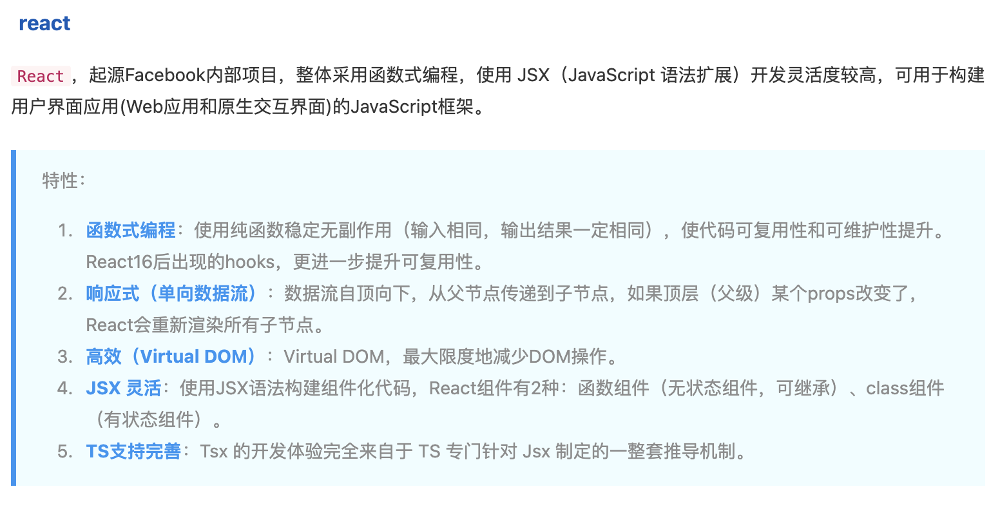

## 问题

### 自我介绍

面试官您好
我叫柴源，也可以叫我的英文名 Emma，我毕业于重庆交通大学，学的是通信工程专业，拥有四年的前端开发工作经验。
在之前的工作当中主要使用的技术栈是 Vue，有一些 Taro+react 开发微信小程序的经验，
最近做的项目是私人承接的，使用的是 Taro+react，主要是做了一个万年历小程序，里面包含了黄历 天气、吉日查询，紫薇排盘等功能，目前还在内测中，微信小程序还没有接入，这个项目我负责了整个项目的开发工作，从项目搭建，到页面的开发，到接口的对接，都是我一个人完成的，这个项目我也是第一次接触 Taro+react，所以在开发过程中也遇到了很多问题，比如 Taro 的坑，比如 Taro 的一些组件
在我的上一份工作中，负责游戏中心管理平台项目，黑鲨商城重构项目，还有一些内部项目的开发工作，公共项目比如权限管理，组件库的搭建等  
也会负责前端的需求分配，还会参与前端招聘等前端组工作
以上是我的自我介绍，谢谢。

### 遇到过什么问题，怎么解决的

### 满意的项目

### 职业规划

### 缺点

### 了解公司问题

1. 技术栈
2. 团队规模
3. 工作内容

### 怎么解释空窗期

1. 回家 9-10
2. 学车 11-3
3. 接活 4-5（一个多月）
   项目搭建-（2）
   登陆-1
   权限系统
   用户管理-增删改查
   角色管理-增删改查，角色权限管理（项目增删改查，
   部门管理
   8 页面（12）

   项目管理-增删改查（2 页-3） 项目状态，项目指派，项目成员
   需求管理（3 页-5）
   我的需求
   新增需求
   需求详情
   需求编辑

4. [2023/06-2023/12]共 21 个页面
   万年历(子页面：节日详情、天气主页、城市查询)、黄历（子页面：吉日查询、吉日详情、时辰宜忌、黄历现代文）、紫薇历（子页面：星测模型），命例库（子页面：新增/修改命例、排盘）、我的（子页面：我的资料、登陆、反馈、问题、详情、日期转换），
   (进度-内测中)

### 模拟面试

## Vue 和 React 对比

### react Hooks 和 Vue3 组合式 API 的区别

react 问题：
不必要的渲染，影响性能
React 使用 useMemo，这也需要传入正确的依赖数组 ；Vue 使用 watch 和 conputed 自动收集计算属性和侦听器的依赖，因此无需手动声明依赖
传递给子组件的事件处理函数会导致子组件进行不必要的更新。Vue 则不用

### React 和 Vue 的区别，怎么选

根据业务特性

- 根据团队适用性、业务适用性、技术生态

  

  ·

引出：

1. 数据劫持
2. observer 观察者
3. 什么是双向数据绑定，怎么实现

### MVC/MVVM

m-model
v-view
c-controller

### 响应式和双向绑定理解

响应式一般指：数据改变驱动视图改变，是单向的
双向绑定：是双向的，视图反过来也可以改变数据。也就是说响应式是双向绑定的一环

### Vue 的特点

MVVM 1.渐进式框架 2.响应式 3.组件化 4.声明式 5.虚拟 DOM

### 声明式和命名式

命名式：每一步的过程都要写成代码，例如改数据后，把 dom 节点的文本改变
声明式：直接改变数据，无需关注数据怎么在页面上更新

### 权限管理

- 登录
- 访问权限：登录才可以访问，
  beforeEach
- 页面权限：
  动态路由 router.addRoute()
- 按钮权限:权限列表，根据权限列表判断是否显示按钮，可以用指令实现

//动态路由
router.addRoute

## JS

### Map 和 Set 的区别

Set 类似于数组，但是成员的值都是唯一的，没有重复的值，可以用来数组去重
Map 键值对的集合，键可以是任何值，Object 的键只可以是字符串
Map 的键值对是有序的，Object 的键值对是无序的

Map 和 Set 都是可以被遍历的
Map 是可枚举的 Set 是不可枚举的

- ps：具有 Symbol.iterator 属性的数据结构都可以被遍历

### Obj 转化成一个二维数组

```js
const obj = { name: 'nick', age: 18 };
function objToArr(obj) {
  return Object.keys(obj).map(key => [key, obj[key]]);
}
//或者使用 Object.entries()
const entries = Object.entries(obj);
```

## CSS

### 重绘和回流

重绘：当渲染树中的一些元素需要更新属性，而这些属性只是影响元素的外观、风格，而不会影响布局的操作，比如 background-color。此时浏览器会将新的样式重新绘制一遍，这个过程称为重绘

回流：当渲染树中的一部分（或全部）因为元素的规模尺寸、布局、隐藏等改变而需要重新构建的过程，这个过程称为回流

怎么减少重绘和回流：

1. 使用 transform 替代 top
2. 使用 visibility 替换 display: none，因为前者只会引起重绘，后者会引发回流（改变了布局）
3. 将动画效果应用到 position 属性为 absolute 或 fixed 的元素上，避免影响其他元素的布局，这样只是一个重绘，而不是回流
4. 避免频繁操作样式，最好一次性重写 style 属性，或者将样式列表定义为 class 并一次性更改 class 属性
5. 使用离线 DOM：创建一个 documentFragment，在它上面应用所有 DOM 操作，最后再把它添加到文档中
6. 避免频繁操作 DOM，将多个操作合并为一个或者使用 documentFragment

### flex

常用于响应式设计和移动端开发中，弹性布局，灵活的分配空间和对齐方式，避免 float 布局的一些问题

flex-basis:length|auto 默认 auto，不计入剩余空间
auto：元素本身宽度
length：元素设置的 width 不再生效

flex: flex-grow flex-shrink flex-basis
flex:auto 元素宽度+分配剩余空间
flex:1 1 auto

flex:1 不缩放，分配剩余空间 width 不生效
flex:1 1 0%

flex:0 不展示
flex:0 1 0%

flex:none 元素本身宽度，不会放大缩小
flex:0 0 auto

flex 只设置 flex-basis，flex-grow flex-shrink 默认 1 1
只设置 flex-grow flex-shrink ，flex-basis 为 0%

align-self: auto | flex-start | flex-end | center | baseline | stretch;
auto 继承父元素属性

### BFC 块级格式化上下文

指的是一个独立的渲染区域，让块级盒子在布局时遵循一些特定的规则。BFC 的存在使得我们可以更好地控制文档流，处理浮动、清除浮动等问题。

BFC 的形成条件包括：

1. 浮动元素（元素的 float 不是 none）
2. 绝对定位元素（元素的 position 为 absolute 或 fixed）
3. 行内块元素（元素的 display 为 inline-block）
4. 表格单元格（元素的 display 为 table-cell）
5. 表格标题（元素的 display 为 table-caption）
6. overflow 值不为 visible 的块元素

BFC 的应用场景包括：
1、清除浮动：
当一个容器内部有浮动元素时，如果没有给容器创建 BFC，那么容器的高度将无法被撑开，导致一些问题，如边框或背景不显示、文字环绕等。可以通过在容器上创建 BFC 来解决这个问题，例如可以将容器的 overflow 设置为 hidden。
ps：清除浮动的方法还有其他，如给父元素设置一定的高度;浮动元素后增加一个元素设置 clear:both

2、避免 margin 重叠：
当两个相邻的盒子都设置了 margin 时，它们之间的距离将会是两者 margin 中较大的一个，而不是将两者相加。如果将其中一个盒子放入一个 BFC 中，可以避免 margin 重叠的问题。

3、实现多栏布局：
通过创建 BFC，可以将容器划分为独立的区域，在这些区域内布局，从而实现多栏布局。

4、防止浮动元素遮盖：
比如清除文字环绕，图片设置 float，文字会环绕图片，如果不想文字环绕，可以给文字设置 BFC，

5、防止父子元素外边距塌陷
父元素设置 overflow:hidden

## 性能优化

1. 减小代码体积-webpack 打包优化
2. 减少重绘和回流
3. 编码习惯
4. 缓存
5. 图片
6. 懒加载
7. 预加载，按需加载
8. 网络优化，减少请求次数，合并请求，减少请求大小

#### web 服务器

服务器软件：apache、nginx

处理请求：  
反向代理：传递到其他服务器  
域名解析：

- 通过前端控制并发数量

```js
const max = 10;
const urlArr = new Array(20).fill(0).map((item, index) => index);
//封装发送请求的服务
const serve = url => {
  return new Promise((resolve, reject) => {
    // 模拟发送请求
    setTimeout(() => {
      resolve(url);
    }, url * 100);
  });
};
//执行发送请求
const run = fn => {
  fn.then(res => {
    console.log(res);
    if (urlArr.length) {
      const _url = urlArr.shift();
      run(serve(_url));
    }
  });
};
const justiposition = (max, urlArr) => {
  for (let i = 0; i < max; i++) {
    const _url = urlArr.shift();
    run(serve(_url));
  }
};
justiposition(max, urlArr);
```

## 安全

1. 跨站脚本攻击（XSS）：

问题： 攻击者注入恶意脚本到网页，用户浏览网页时执行该脚本。
建议： 使用 CSP（内容安全策略）来限制允许加载的资源，对用户输入进行输入验证和转义，不信任的数据不应该被直接插入 HTML。

2. 跨站请求伪造（CSRF）：

问题： 攻击者诱使用户在未经许可的情况下执行意外的操作，例如更改密码或提交表单。
建议： 使用 CSRF 令牌来验证请求的合法性，不要在 GET 请求中执行敏感操作。

3. 内容安全策略（CSP）：

问题： 如果 CSP 配置不当，它可能会导致网页加载的资源受到限制，甚至阻止合法的资源加载。
建议： 配置 CSP 以仅允许受信任的资源加载，进行定期检查和测试以确保不会影响网站功能。

4. 点击劫持：
   问题： 攻击者通过透明覆盖在网页上的可点击区域欺骗用户，以执行未经许可的操作。
   建议： 使用 Frame Busting 技术或 X-Frame-Options 来防止网页被嵌套到恶意站点中。
5. 不安全的依赖：

问题： 使用不安全、过期或有漏洞的第三方依赖库。
建议： 定期更新和审查依赖库，仅使用可信赖的库，了解其安全性。

6. 敏感数据泄露：
   问题： 未加密的敏感数据在传输中泄露，或者敏感信息存储在前端代码中。
   建议： 使用 HTTPS 来加密数据传输，不要将敏感信息存储在前端，遵循数据保护法规。

7. 不安全的存储：
   问题： 在本地存储（LocalStorage、SessionStorage）中存储敏感信息，容易被窃取。
   建议： 避免在本地存储中存储敏感数据，使用 Cookie 和服务器端存储代替。

8. 安全标头：
   问题： 未配置安全 HTTP 头（如 X-Content-Type-Options、X-XSS-Protection、Strict-Transport-Security 等）。
   建议： 配置适当的 HTTP 头以增强网站的安全性。

9. 敏感信息在 URL 中：

问题： 在 URL 中传递敏感信息，如密码或会话标识。
建议： 避免在 URL 中传递敏感信息，使用 POST 请求和安全的身份验证方法。

10. 文件上传漏洞：

问题： 允许用户上传恶意文件，可能导致服务器漏洞。
建议： 对用户上传的文件进行验证和筛选，不要直接执行上传的文件。

## 跨域

## 日志/打点

收集前端错误警告： 以 Vue 为例
收集接口错误：响应拦截器，统一处理报错

## webpack/vite

## 实现登录 验证码

复制粘贴
验证码一个格子一个格子的输入
扫二维码登录=>

## Vue 组件库的封装/组件库的发布

## 微前端

## 低代码平台

### 面试问题

- 浏览器解析到静态资源是压缩过的还是没有

  如果是传输过程中的加密，浏览器可以识别

- 数组求交集

```js
const a = [1, 2, 3];
const b = [3, 4, 5];
const mapB = new Set(b);
const filterArr = a.filter(item => mapB.has(item));
console.log(filterArr);
```

- 前端新技术
- canvas 能不能使用 web workers
  不可以，因为 canvas 操作 DOM，web workers 不能操作 DOM
  <!-- OffscreenCanvas -->

- 找到一个连续子序列，使得子序列的和最大

```js
const arr = [-2, 1, -3, 4, -1, 2, 1, -5, 4];
const amap = new Map([]);
for (let i = 0; i < arr.length; i++) {
  let sum = 0;
  for (let j = i; j < arr.length; j++) {
    sum += arr[j];
    amap.set(sum, [i, j]);
  }
}
const max = Math.max(...amap.keys());
const subArr = arr.slice(amap.get(max)[0], amap.get(max)[1] + 1);
console.log(subArr);
```
