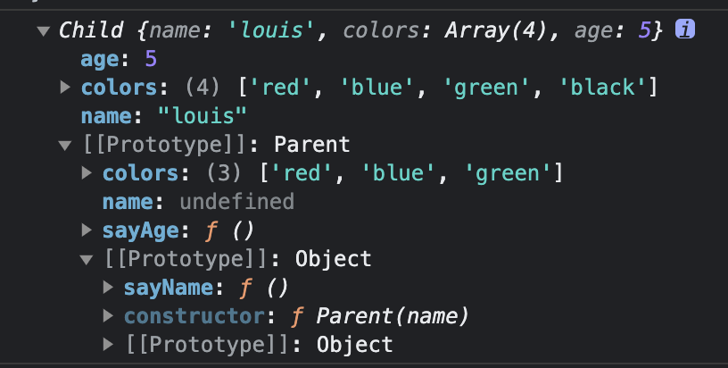
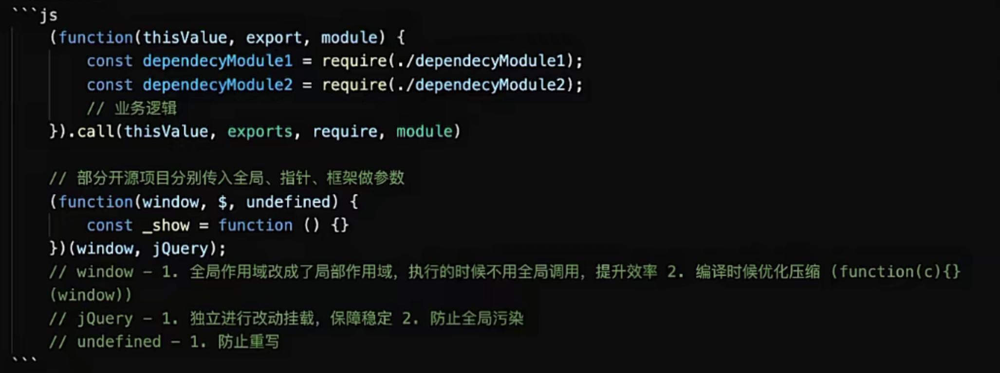
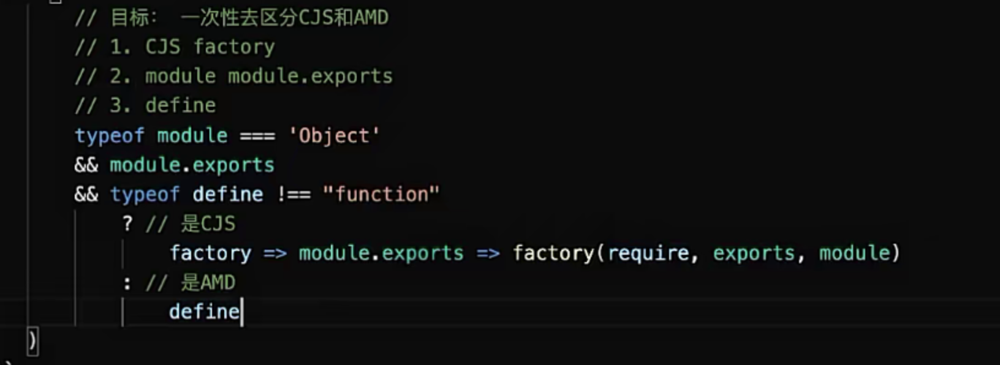

## js 语言设计的优点和缺点

JavaScript 可以看作是 ECMAScript、DOM 和 BOM 的集合。

1. ECMAScript：这是 JavaScript 的核心，定义了语言的语法和基本对象。

2. Document Object Model (DOM)：这是一个平台和语言中立的接口，允许程序和脚本动态地访问和更新文档的内容、结构和样式。

3. Browser Object Model (BOM)：允许 JavaScript 与浏览器进行交互。

优点：

1. 脚本语言，在浏览器可以直接运行，不需要编译，可以直接在浏览器运行，方便开发者快速开发和调试
2. 弱类型语言，不需要声明变量类型，代码编写更灵活，但是也容易导致错误
3. 跨平台特性，可以在多环境运行，包括浏览器、服务器、 移动端
4. 强大的客户端交互性能。因为它能够直接嵌入 HTML 和 CSS，因此可以轻松地实现动态交互效果，增强用户体验。
5. 扩展性 各种可重用的库和框架

缺点：

1. 兼容性问题。不同的浏览器支持不同的 JavaScript 版本和功能
2. 在浏览器可以直接运行，也容易受到恶意攻击，例如跨站点脚本攻
3. 性能问题，例如在处理大量数据或要求极高的计算方面
4. 弱类型语言，但是也容易导致错误

## JS 的执行-两个阶段

- 预编译：  
   变量提升，函数提升，注意 var 声明的变量会被提升到作用域的顶部，但是赋值不会提升，函数声明会被提升到作用域的顶部，但是函数表达式不会被提升

  变量提升：var 声明的变量会被提升到作用域的顶部，但是赋值不会提升
  函数提升：函数声明会被提升到作用域的顶部，但是函数表达式不会被提升

```js
foo(); //正常执行
bar(); //报错 bar is not a function
func(); //报错 func is not defined
function foo() {}
var bar = function () {};
const func = function () {};
```

上述代码编译后

```js
function foo() {} //函数声明会被提升到作用域的顶部
const bar = undefined; //var 声明的变量会被提升到作用域的顶部，但是赋值不会提升
foo(); //正常执行
bar(); //报错
func(); //报错
bar = function () {};
const func = function () {}; //const 声明的变量不会被提升->暂时性死区
```

- 解释执行：从上到下执行

## 变量如何赋值

var a = 1;

1. 编译阶段：var a 先在当前作用域查找变量是否存在，存在则忽略，不存在则声明变量
2. 执行阶段：a = 1; 先在当前作用域查找变量是否存在，存在则赋值，不存在则向上一级作用域查找，直到全局作用域，若全局作用域不存在则在全局作用域声明变量

```js
var a = 1;
function foo() {
  var a = 2;
}
foo();
console.log(a); //1
```

```js
var a = 1;
function foo() {
  a = 2;
}
foo();
console.log(a); //2
```

## 作用域：是根据变量名查找变量的规则/定义了变量作用范围的一套规则，它决定了代码区块中变量的可见性

全局作用域，函数作用域，块级作用域

- 词法作用域/静态作用域：
  代码在定义时就确定了作用域，不会改变--取决于在哪里声明
- 动态作用域：
  代码在执行时确定作用域，会改变--取决于在哪里调用

```js
foo(10);
function foo(a) {
  var foo; //在当前函数作用域创建变量，但未赋值
  console.log(foo); //undefined
  foo = a;
  console.log(foo); //10
}
console.log(foo); //打印函数
foo = 1;
console.log(foo); //1
```

## 执行上下文？

## 闭包

官方： 一个函数和捆绑外部环境状态的引用，组合在一起就是闭包
（函数内部引用了函数外部作用域的变量就形成了闭包）

实际应用中一般：函数嵌套函数，内部函数可以访问外部函数的变量并且引用，将内部函数返回，内层函数可在全局下访问，形成闭包

也可以说全局可以通过闭包的方式访问函数内部的变量，并且变量不会被垃圾回收机制回收

```js
//立即执行函数
for (var i = 0; i < 10; i++) {
  (function (i) {
    setTimeout(function () {
      console.log(i);
    }, 1000);
  })(i);
}
```

闭包的使用场景

- 模块化：私有变量，私有方法
- 避免全局污染：变量不被外部访问
- 延长变量生命周期：变量不会被垃圾回收机制回收
- 保持状态：闭包可以捕获外部函数的变量，并在函数执行时保持其状态。这使得闭包在事件处理、回调函数等场景中非常有用。
- 节流防抖
- 函数柯里化

缺点：占用内存，即时回收

问题闭包内的变量为什么不会被回收？
垃圾回收机制？

## this

首先，this 的指向是动态的
但是一直指向所在函数的真实调用者

全局作用域内，非严格模式默认指向 window 对象
隐式绑定：在对象里的函数指向当前对象
显式绑定：bind call aplly 指向传入的第一个参数对象

new > bind call apply > obj.func() > func()

## 面向对象

抽象公共属性和方法，封装成类，实例化对象

### 原型 原型链 继承

原型：引用对象都有一个 prototype 属性，指向一个对象，这个对象就是原型对象，
原型对象中有一个 constructor 属性，指向函数本身

原型链：原型对象中有一个\_\_proto\_\_属性，指向上一级原型对象(Object.prototype)，这样就形成了一条链，就是原型链,原型链的尽头是 null

```js
const a = Object.create({}); //a的原型对象是{} a__ptoto__={},{}__proto__=Object.prototype

const b = {}; //b的原型对象是Object.prototype,所以 b__proto__=Object.prototype

const c = new Object(null); //c的原型对象是null，所以 c__proto__=null
```

### new 原理

```js
const Parent = function (name) {
  this.name = name;
};
Parent.prototype.getName = function () {
  console.log(this.name);
};
const child = new Parent('louis');
Parent.prototype.constructor === Parent; //true
child.__proto__ === Parent.prototype; //true
child.constructor === Parent; //true
```

new 创建一个新对象，将构造函数的作用域赋给新对象（因此 this 指向这个新对象），执行构造函数中的代码，将构造函数的返回值赋给新对象，如果构造函数没有返回值，则返回这个新对象

```js
function myNew(func) {
  const obj = Object.create(func.prototype); //创建对象，这个对象指向构造函数的原型对象
  const result = func.apply(obj, Array.prototype.slice.call(arguments, 1)); //改变this指向，执行构造函数
  return typeof result === 'object' ? result : obj; //有返回值则返回返回值，没有则返回新对象
}
```

Array.prototype.slice.call(arguments,1) 或[].slice.call(arguments,1)将具有 length 属性 arguments 转成数组  
arguments 是类数组对象，没有数组的方法，所以需要借用数组的方法
slice 方法用于数组返回的是数组，用于字符串返回的是字符串，arguments 转为数组第二个元素开始才是参数，所以需要截取

## 继承

继承：利用原型让一个引用类型继承另一个引用类型的属性和方法

- 原型继承
  B 继承 A，重写原型对象，代之以一个新类型的实例
  B 的原型对象 \_\_proto\_\_ A 的原型对象
  A 的实例\_\_proto\_\_A 的原型对象

```js
function A() {
  this.name = 'a';
}
A.prototype.getName = function () {
  console.log(this.name);
};
function B() {
  this.name = 'b';
}
B.prototype = new A();
const instance = new B();
instance.getName(); //b
//是 b 不是 a 的原因，定义构造函数 B 的时候把属性 name 重写了，这也是原型继承的缺点，多个实例对引用类型的操作会被篡改。
```

- 构造函数继承
  不使用原型，父类的构造函数来增强子类实例，等同于复制父类的实例给子类

```js
function Parent() {
  this.name = 'parent';
}
function Child() {
  Parent.call(this);
}

const instance1 = new Child();
instance1.name = 'child';
const instance2 = new Child();
console.log(instance2.name); //parent
// 多个实例对引用类型的操作不会被篡改
//只能继承父类的实例属性和方法，不能继承原型属性/方法
//无法实现复用，每个子类都有父类实例函数的副本，影响性能
```

- 组合继承
  结合原型链继承和构造函数继承

```js
function Parent(name) {
  this.name = name;
  this.colors = ['red', 'blue', 'green'];
}
Parent.prototype.sayName = function () {
  console.log(this.name);
};
function Child(name, age) {
  Parent.call(this, name);
  this.age = age;
}
Child.prototype = new Parent();
Child.prototype.sayAge = function () {
  console.log(this.age);
};
const instance1 = new Child('louis', 5);
instance1.colors.push('black');
console.log(instance1); //"red,blue,green,black"
instance1.sayName(); //louis
instance1.sayAge(); //5

const instance2 = new Child('zhai', 10);
console.log(instance2.colors); //"red,blue,green"
instance2.sayName(); //zhai
instance2.sayAge(); //10
//父类的方法可以复用
//父类构造函数中的引用属性不会被共享,可以在Child构造函数中向Parent构造函数中传参
//调用了两次父类构造函数, 造成了不必要的消耗
```



- 原型式继承

```js
// 对参数对象的一种浅复制
//创建一个拷贝方法，新建空函数，将传入的对象作为这个空函数的原型，返回这个空函数的实例
function objectCopy(obj) {
  function Fun() {}
  Fun.prototype = obj;
  return new Fun();
}
let person = {
  name: 'yhd',
  age: 18,
  friends: ['jack', 'tom', 'rose'],
  sayName: function () {
    console.log(this.name);
  }
};

let person1 = objectCopy(person);
person1.name = 'wxb';
person1.friends.push('lily');
person1.sayName(); // wxb

let person2 = objectCopy(person);
console.log(person2.name); //yhd
person2.name = 'gsr';
person2.friends.push('kobe');
person2.sayName(); // "gsr"

console.log(person.friends); //["jack", "tom", "rose", "lily", "kobe"]
//父类方法可复用
//父类的引用会被所有子类所共享
//子类实例不能向父类传参
```

- 寄生式继承

//使用原型式继承对一个目标对象进行浅复制，增强这个浅复制的能力

```js
//对目标对象进行浅复制
function objectCopy(obj) {
  function Fun() {}
  Fun.prototype = obj;
  return new Fun();
}
//扩展目标对象
function createAnother(original) {
  let clone = objectCopy(original);
  clone.getName = function () {
    console.log(this.name);
  };
  return clone;
}

let person = {
  name: 'yhd',
  friends: ['rose', 'tom', 'jack']
};

let person1 = createAnother(person);
person1.friends.push('lily');
console.log(person1.friends);
person1.getName(); // yhd

let person2 = createAnother(person);
console.log(person2.friends); // ["rose", "tom", "jack", "lily"]
```

- 寄生式组合继承

寄生式组合继承可以算是引用类型继承的最佳模式

```js
//寄生式
function objectCopy(obj) {
  function Fun() {}
  Fun.prototype = obj;
  return new Fun();
}

function inheritPrototype(child, parent) {
  let prototype = objectCopy(parent.prototype); // 创建对象
  prototype.constructor = child; // 增强对象
  Child.prototype = prototype; // 赋值对象
}
//组合式
function Parent(name) {
  this.name = name;
  this.friends = ['rose', 'lily', 'tom'];
}

Parent.prototype.sayName = function () {
  console.log(this.name);
};

function Child(name, age) {
  Parent.call(this, name);
  this.age = age;
}

inheritPrototype(Child, Parent);
Child.prototype.sayAge = function () {
  console.log(this.age);
};

let child1 = new Child('yhd', 23);
child1.sayAge(); // 23
child1.sayName(); // yhd
child1.friends.push('jack');
console.log(child1.friends); // ["rose", "lily", "tom", "jack"]

let child2 = new Child('yl', 22);
child2.sayAge(); // 22
child2.sayName(); // yl
console.log(child2.friends); // ["rose", "lily", "tom"]
//只调用一次父类构造函数
//Child 可以向 Parent 传参
//父类方法可以复用
//父类的引用属性不会被共享---这也是拷贝父类再进行继承的原因
```

好理解的方式

```js
const Parent = function (name) {
  this.name = name;
};
Parent.prototype.getName = function () {
  console.log(this.name);
};
const Child = function (name) {
  Parent.call(this, name);
};
Child.prototype = Object.create(Parent.prototype);
Child.prototype.constructor = Child; //重写constructor
```

```js
//Object.create方法没有可以这样写
function objectCopy(obj) {
  function Fun() {}
  Fun.prototype = obj;
  return new Fun();
}

//const a = Object.create(b) =>a.__proto__=b
//如果用new关键字那么 a.__proto__=b.prototype
//所以需要fun.prototype = b
//objectCopy返回的是new Fun()，所以有个 Fun.prototype = obj
```

- class 原理，

- class 和寄生组合继承的区别

class 继承的时候可以继承静态属性和方法
子类中需要在 cunsructor 中调用 super 方法，因为子类的 this 需要通过父类的构造函数完成初始化

class 是严格模式

## ==和！类型转换

==的隐式转换规则，两边类型不一致时，会将两边的类型转换为 Number 类型，再进行比较

1. null 和 undefined 相等，且不会转换为其他类型
2. String 和 Number 比较，String 会转换为 Number
3. Boolean 和其他类型比较，Boolean 会转换为 Number
4. 对象和非对象比较，对象会转换为原始类型再进行比较,
5. 两个对象通过引用地址进行比较
6. NaN 和任何值都不相等，包括自身

`!`的隐式转换规则，会将操作数转换为 Boolean 类型，再取反
在 JavaScript 中，以下值在转换为布尔值时会变为 `false`：

- `false`
- `0`
- `''`（空字符串）
- `null`
- `undefined`
- `NaN`

所有其他的值，包括所有的对象和数组（即使它们是空的），在转换为布尔值时都会变为 `true`。
因此，空数组 `[]` 转换为布尔值的结果是 `true`，然后取反，结果是 `false`。

```js

null==0//false
null==false//false
undefined==0//false
undefined==false//false
0==false//true
[]==[]//false
[]==![]//true
[]==0//true[]转换为字符串''，字符串''转换为数字0
[]==''//true []转换为字符串''
[]==false//true
{}=={}//false
{}==false//false
{}==0//false 对象{} 会被转换为其字符串表示，即 '[object Object]'然后被转换为数字，但因为它不是一个有效的数字字符串，所以结果是 NaN。
{}==''//false
{}==[]//false
```

### null 和 undefine 区别

null 表示一个空对象指针，typeof null 返回 object
undefined 表示一个未定义的原始值，typeof undefined 返回 undefined

### typeof 和 instanceof 区别

- typeof 用于判断基本类型 number、string、boolean、symbol、undefined、object、function
  null、array、对象都会是 object

- instanceof 用于判断对象类型不能用于基本类型的判断，用于判断构造函数的 prototype 是否在某个实例的原型链上，
  ps：通过构造函数生成的基本类型，instanceof Object 为 true，因为基本类型会转换为对象

```js
const a = '1';
const b = new String(1);
a instanceof Object; //false
b instanceof Object; //true
console.log(a); //1
console.log(b); //String {"1"}
const c = [];
c instanceof Array; //true
c instanceof Object; //true

const b = 5;
b.__proto__ == Number.prototype;
```

- Object.prototype.toString.call() 用于判断引用类型，可以区分数组、对象、null
- 区分数组 Array,isArray()

## 模块化

模块化解决的问题：文件代码量大、命名冲突

IIFE 是语法基础

1.文件分离

面试问题：scripe 标签参数 defer 和 async 区别

- normal：代码一行一行的解析，script 标签，下载文件，下载完成立刻解析，解析完成后再下载下一个文件，如果文件很大，会阻塞页面的渲染，所以一般放在 body 标签底部
- async：解析到标签，开始异步下载，下载完成后立刻解析，还是会阻塞主线程
- defer ： 解析到标签，开始异步下下载，同时继续解析，解析完成后再执行，如果有多个 defer 标签，会按照顺序执行

async 和 defer 不同浏览器的兼容性问题

面试问题方向：浏览器怎么执行渲染等浏览器原理、同步异步原理、模块化加载原理

2.解决命名冲突
IIFE 立即执行函数，将代码放在一个函数中，形成一个单独的作用域，避免命名冲突

```js
const module = (function () {
  const count = 0;
  const add = () => {
    count++;
  };
  return {
    add,
    count
  };
})();
module.add;
```

面试问题方向：深入模块化实现 、Vue/React 怎么实现的、专转向设计模式-模块化的设计模式

### 分类

#### CMD/CJS - CommonJS

通过 module + export 对外暴露接口，通过 require 引入模块

- node.js 指定的标准，针对服务端的，同步加载

  > 优点：按需加载， 依赖就近

  > 缺点：依赖于打包（CMD 在浏览器使用需要 webpack 等打包工具转换为浏览器可运行的代码），扩大模块内代码体积

  > ps：因为服务端文件都在本地，不需要考虑加载时间，所以是同步加载

- 基于 CMD 规范 - sea.js

```js
//a.js
module.exports = {
  a: 1
};
//b.js
const a = require('./a.js');
console.log(a.a); //1
```

-------没懂 start


```js
(function (window, $, undefined) {
  const _show = function () {};
})(window, jquery);
// window - 1. 全局作用域改成了局部作用域，执行的时候不用全局调用，提升效率 2，编译时候优化压缩(function(c)(window))
// jQuery - 1，独立进行改动挂载，保障稳定 2，防止全局污染
// undefined - 1，防止重写
```

------没懂 end

- 问题-不能异步加载依赖

#### AMD - Asynchronous Module Definition

异步加载依赖 + 定制回调函数

- 浏览器环境下的模块化规范，异步加载，依赖前置
  > 优点：异步加载，提高加载效率
  > 缺点：依赖前置不能按需加载

```js
define(id, [depends], callback);
require([module], callback);
```

```js
//a.js
define(['./b.js'], function (b) {
  return {
    a: 1
  };
});
//b.js
define(function () {
  return {
    b: 2
  };
});
//c.js
require(['./a.js', './b.js'], function (a, b) {
  console.log(a.a); //1
  console.log(b.b); //2
});
```

面试问题： 如何对已有代码兼容-CMD 转 AMD

1. 增加 define
2. module.exports 改为 return

```javascript
// CommonJS (CMD) 模块
var moduleA = require('moduleA');
var moduleB = require('moduleB');

function myModule() {
  return moduleA.doSomething() + moduleB.doSomething();
}

module.exports = myModule;
```

```javascript
// AMD 模块
define(['moduleA', 'moduleB'], function (moduleA, moduleB) {
  function myModule() {
    return moduleA.doSomething() + moduleB.doSomething();
  }

  return myModule;
});
```

在 AMD 模块中，我们使用 `define` 函数来定义模块，它接受两个参数：一个是依赖模块的数组，另一个是工厂函数。工厂函数接受依赖模块作为参数，并返回这个模块的导出值。

#### UMD

兼容 AMD 和 CMD

判断是 AMD 还是 CMD


- AMD 规范中，会有一个全局的 `define` 函数，并且这个函数有 `amd` 属性。
- CMD 规范中，会有一个全局的 `exports` 对象和 `module` 对象。

```js
(function (root, factory) {
  if (typeof define === 'function' && define.amd) {
    // AMD
    define(['jquery'], factory);
  } else if (typeof exports === 'object') {
    // Node, CommonJS-like
    module.exports = factory(require('jquery'));
  } else {
    // Browser globals (root is window)
    root.returnExports = factory(root.jQuery);
  }
})(this, function ($) {
  //    methods
  function myFunc() {}

  //    exposed public method
  return myFunc;
});
```

#### AMD 规范

#### ESM

export + import

静态导入和导出，只能在顶层使用，不可以在代码块或函数中导入  
因为 JS 引擎需要在编译阶段就确定模块的依赖关系，而不是在代码执行阶段确定，所以不能在代码块或函数中导入

动态模块-ES11

```js
import('a.js').then(dynamicESModule => {
  dynamicESModule.in crease();
});
```

## stopImmediatePropagation 阻止当前元素的其他事件处理程序被调用

## for

- for in 遍历对象的可枚举属性，还会遍历原型链上的属性

```ts
class Parent {
  name: 1;
}
class Child extends Parent {
  age: 18;
}
for (let key in new Child()) {
  console.log(key); //name age
}
```

- for of 遍历可迭代对象的值(数组、字符串、Set、Map、arguments)

## 浏览器

## 函数式编程

一种编程范式，将计算过程视为一系列的函数调用，功能的编排

- 要点/核心概念：

1. 纯函数：相同的输入永远会得到相同的输出，没有副作用
2. 不可变性：不可改变源数据，
   无副作用： 函数的内部不可以对外部产生影响
3. 函数是一等公民：函数可以作为参数，也可以作为返回值
4. 高阶函数：接受一个或多个函数作为参数
5. 递归
6. 函数组合：将多个函数组合成一个函数

- 惰性函数
  第一次调用时需要判断，之后就不需要判断了，避免重复计算

```js
//if-else 判断很多的逻辑
let program = type => {
  if (type === 'a') {
    program = () => {
      console.log('a');
    };
    return program;
  } else if (type === 'b') {
    program = () => {
      console.log('b');
    };
    return program;
  } else if (type === 'c') {
    program = () => {
      console.log('c');
    };
    return program;
  }
};
program('b')(); //b
program(); //b
```

- 流水线的组装
  加工&组装--基于函数柯里化

```js
//函数柯里化
//可以使得函数更容易被组合
//参数复用，固定部分参数的值，返回一个新的函数，使得这部部分参数的执行结果可以被复用
//延迟执行，不立即执行，返回一个新的函数
const curry = fn => {
  return function curried(...args) {
    cosole.log(args);
    if (args.length >= fn.length) {
      return fn.apply(this, args);
    }
    return function (...args2) {
      return curried.apply(this, args.concat(args2));
    };
  };
};
// 使用
function sum(a, b, c) {
  return a + b + c;
}

let curriedSum = curry(sum);

console.log(curriedSum(1)(2)(3)); // 输出 6
```

```js
//靠前传入的函数最后执行
const compose = (f1, f2) => {
  return f1(f2(value));
};
```

```js
//组合函数
function compose(...fns) {
  return function (value) {
    //reduceRight(fn(),value) 从右向左开始计算
    //value传递给函数的初始值
    //将上一次的执行结果，传递给下一个函数执行
    return fns.reduceRight((acc, fn) => fn(acc), value);
  };
}

// 使用
function double(x) {
  return x * 2;
}

function increment(x) {
  return x + 1;
}

let doubleThenIncrement = compose(increment, double);

console.log(doubleThenIncrement(2)); // 输出 5
```

- 函子
  用于处理函数组合时的异常情况，函子是一个特殊的容器，通过一个普通的对象来实现，该对象具有 map 方法，map 方法可以运行一个函数对值进行处理（变形关系），然后返回一个包含新值的函子（容器）

```js
class Functor {
  constructor(value) {
    this.value = value;
  }

  map(fn) {
    return new Functor(fn(this.value));
  }
}

let functor = new Functor(2);
let newFunctor = functor.map(value => value * 2);

console.log(newFunctor.value); // 输出 4
```

- 面试问题
  函数式编程的难点/重点 ->如何拆分，编排

## 发布订阅模式

使用了一个事件通道，发布者发布事件到事件通道，订阅者从事件通道订阅事件，从而实现了发布订阅模式

```js
class EventChanel {
  constructor() {
    this.subscribers = {};
  }
  //订阅事件
  subscribe(event, callback) {
    if (!this.subscribers[event]) {
      this.subscribers[event] = [];
    }
    this.subscribers[event].push(callback);
  }
  //发布事件
  publish(event) {
    if (this.subscribers[event]) {
      this.subscribers[event].forEach(callback => callback());
    }
  }
}
```

## 观察者模式

一个被观察对象（Subject），一个观察者对象（Observer），被观察对象发生变化时，通知观察者

```js
class Subject {
  constructor() {
    this.observers = [];
  }
  addObserver(observer) {
    this.observers.push(observer);
  }
  notifyAllObservers() {
    this.observers.forEach(observer => observer.update());
  }
}
class Observer {
  update() {
    console.log('update');
  }
}
const subject = new Sunject();
const observer = new Observer();
subject.addObserver(observer);
subject.notifyAllObservers();
```

- 两者区别
  发布订阅模式，发布者和订阅者不知道对方的存在，通过事件通道进行通信
  观察者模式，被观察者和观察者知道对方的存在，被观察者发生变化时，通知观察者

- 实际上两者应该是一样的，订阅者通过订阅事件，发布者在事件发生时通知订阅者，订阅者执行回调函数，

## Array reduce/reduceRight

接收一个函数为累加器，数组中的每个值（从左到右）开始合并，最终为一个值

## call aply bind

改变 this 的指向，call 可以直接写多个参数，apply 需要用数组方式传递
call、 aply 立即执行 ，bind 返回一个函数，需要调用才会执行
option1:this
call 、bind 可以传递多个参数，aply 多个参数用数组方式传递

## 宏任务和微任务/事件循环（eventLoop）

同步和异步：
同步：在主线程上排队执行的任务，只有前一个任务执行完毕，才能执行后一个任务
异步：不进入主线程，而进入任务队列的任务，主线程任务执行完毕会从任务队列中调用一个异步任务进入主线程执行，

先同步任务再异步任务
异步任务分为宏任务和微任务，先微任务最后宏任务
同步任务>微任务>宏任务

宏任务 ：宏任务的时间粒度比较大，执行的时间间隔是不能精确控制的，对一些高实时性的需求就不太符合
1、定时器任务： 如 setTimeout、setInterval
2、I/O 任务：例如网络请求、文件读写等需要进行 I/O 操作的任务
3、用户交互任务：例如点击事件、输入事件等与用户交互的相关任务
4、渲染任务：当浏览器需要重绘或重新布局时触发的任务

微任务：一个需要异步执行的函数，执行时机是在主函数执行结束之后、当前宏任务结束之前
Promise.then()、await 后面的代码、MutationObserver 回调：当 DOM 发生变化时触发的回调函数

宏任务里的异步任务怎么执行的：
宏任务执行完毕后，会检查微任务队列，如果有微任务，就会执行微任务，直到微任务队列为空，然后再执行下一个宏任务

事件循环：事件循环的机制确保了 JavaScript 中异步代码的顺序性和可预测性。

```js
console.log('script start');

setTimeout(function () {
  console.log('setTimeout');
  Promise.resolve().then(function () {
    console.log('promise3');
  });
  setTimeout(function () {
    console.log('setTimeout1');
  }, 0);
}, 0);
setTimeout(function () {
  console.log('setTimeout2');
  Promise.resolve().then(function () {
    console.log('promise4');
  });
  setTimeout(function () {
    console.log('setTimeout3');
  }, 0);
}, 0);
Promise.resolve()
  .then(function () {
    console.log('promise1');
  })
  .then(function () {
    console.log('promise2');
  });

console.log('script end');
//script start
//script end
//promise1
//promise2
// setTimeout
//promise3
// setTimeout2
// promise4
//setTimeout1
// setTimeout3
```

## 深浅拷贝

实现深拷贝：创建一个新的对象，然后递归地复制原始对象的所有嵌套对象和元素，而不仅仅是复制它们的引用
JSON.stringfy 缺点不能拷贝函数

```js
const originObj = {
  a: 1,
  b: [1, 2, [3, 4, [5]]],
  c: {
    d: 1,
    e: { f: 'a' }
  },
  g: function () {
    console.log('g');
  }
};

const deepClone = obj => {
  if (typeof obj !== 'object' || obj == null) return obj;
  let newObj;
  if (typeof obj == 'function') {
    newObj = obj;
  } else {
    //数组或对象
    newObj = Array.isArray(obj) ? [] : {};
    for (let key in obj) {
      if (obj.hasOwnProperty(key)) {
        //不是原型链上继承的属性
        newObj[key] = deepClone(obj[key]);
      }
    }
  }

  return newObj;
};
console.log(deepClone(originObj));
```

实现浅拷贝：浅拷贝是指创建一个新对象，然后将原始对象的元素（或引用）复制到新对象中，但是新对象中的元素仍然是对原始对象元素的引用。浅拷贝只会复制原始对象的一层结构，而不会递归复制嵌套对象的内部结构。

1. 扩展运算符
2. Object.assign

## 垃圾回收机制

垃圾产生：创建一个基本类型、对象、函数……都是需要占用内存的，内存由浏览器的引擎分配，当不再使用这些内存时，就需要将其释放掉，这些不再使用的内存就是垃圾

JavaScript 垃圾回收机制的原理就是定期找出那些不再用到的内存（变量），然后释放其内存

- 标记清除算法

1. 垃圾收集器在运行时会给内存中的所有变量都加上一个标记，假设内存中所有对象都是垃圾，全标记为 0
2. 然后从各个根对象开始遍历，把不是垃圾的节点改成 1
3. 清理所有标记为 0 的垃圾，销毁并回收它们所占用的内存空间
4. 最后，把所有内存中对象标记修改为 0，等待下一轮垃圾回收

缺点：会导致内存空间不连续碎片化

- 引用计数算法

1.  当声明了一个变量并且将一个引用类型赋值给该变量的时候这个值的引用次数就为 1
2.  如果同一个值又被赋给另一个变量，那么引用数加 1
3.  如果该变量的值被其他的值覆盖了，则引用次数减 1
4.  当这个值的引用次数变为 0 的时候，说明没有变量在使用，这个值没法被访问了，回收空间，垃圾回收器会在运行的时候清理掉引用次数为 0 的值占用的内存
    缺点：需要计数器；如果变量之间互相引用，不会被回收，可能会造成内存泄漏

- V8 优化 分代式垃圾回收
  分为老生代和新生代
  新生代：存活时间短，垃圾回收频繁
  老生代：占用空间大，存活时间长的，垃圾回收不频繁，采用标记清除算法
  新生代分为：使用区和空闲区，
  使用区，当使用区快被写满时，就需要执行一次垃圾清理操作
