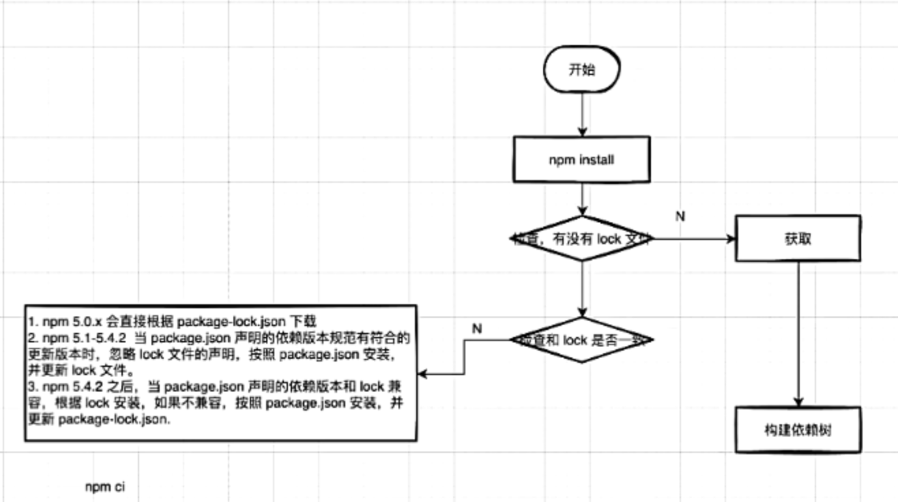

## 简介

JS 的服务端运行环境，基于 google 的 V8 引擎

## 应用场景

- 跨平台开发：PC web h5 weex
- 后端开发：API RPC
- 前端开发：前端工具的运行环境，如 webpack，gulp
- 工具开发：脚步工具，构建工具，自动化工具

## 问题

- 单线程，当线程崩溃会影响整个进程-解决方案：cluster\pm2
- node 对 myspl、mongodb 等 的支持不够好，不适合做大量的数据库操作
- 安全问题

## node 和浏览器的区别

1. API：node 环境没有 DOM、 BOM，浏览器中没有 fs 、path、os 等模块
2. 环境：node 是服务端 JS 运行环境，浏览器是客户端 JS 运行环境
3. 模块：node 支持 CMD 规范，浏览器支持 AMD 规范
4. 事件循环：node 中的事件循环基于 libuv 实现，浏览器中的事件循环基于宿主环境实现

## node 架构组成

- V8 引擎：JS 解析执行引擎
- libuv：事件循环、异步 IO
- http-parser：http 解析
- c-ares：dns 解析
- OpenSSL：加密解密
- zlib：压缩解压
- CPU、GPU、OS、内存等

## npm

- npm：node 包管理工具
- nvm：切换 node 版本
- nrm：切换 npm 源

### npm 安装依赖

### npm 缓存

### npm 和 yarn

npm V5 前的版本
