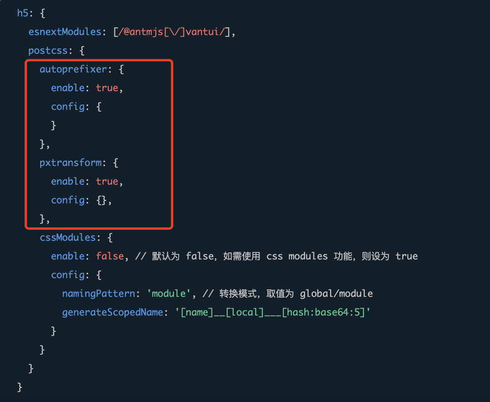
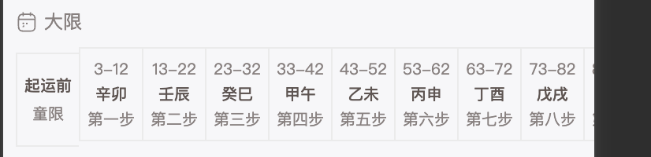

## 2023/8/1

- 按照官网在 config/index.js 和 tsconfig.json 配置 alias，编译时会报错，此时需要在 config/index.js 添加 const path = require('path')

```JS
//config/index.js
const path = require('path')
const config = {
 alias: {
    '@/components': path.resolve(__dirname, '..', 'src/components'),
    '@/utils': path.resolve(__dirname, '..', 'src/utils'),
  },
}

```

```json
//tsconfig.json
{
  "compilerOptions": {
    "paths": {
      "@/components/*": ["./src/components/*"],
      "@/utils/*": ["./src/utils/*"]
    }
  }
}
```

- 在文件中直接 import 'xxx.css'是全局样式，用 react 的 CSS Module 开启局部样式

## 2023/8/2

- 在 CSS Module 文件更改组件库 vant 的样式

```scss
//eg，会在全局生效
:global(.van-nav-bar) {
}
```

- 问题：scss 在全局样式 app.scss 设置 scss 变量，在 CSS Module 样式文件访问不到
  在配置文件中加入该配置也无效

  ```js
  const config = {
    ...
    sass: {
      resource: [path.resolve(__dirname, '..', 'src/app.scss')],
      data:"$color:'white'"
    },
  }

  ```

* 问题： 使用 CSS Module 设置样式 className={classes.name},name 不能是一个变量？

### 8/8

- 自定义 navbar 页面配置

```js
export default definePageConfig({
  navigationStyle: 'custom', //开启自定义navbar
  usingComponents: {
    MainNavBar: '../../components/MainNavBar'
  }
});
```

### 8/9

使用 vant NavBar
问题：wx 小程序 NavBar 会自适应不同机型，此时页面需要一个 padding，如何根据不同机型自适应  
8/14 解决：在 NavBar 外层包裹了一层 position:sticky

问题：如何根据不同机型 NavBar 增加的自适应 padding-top，给页面 bg-color 统一增加相应的高度

### 8/10

- taro-iconfont-cli
  wx 小程序 渲染出来的额 icon 宽高单位为 px 无法改动，不同屏幕尺寸 icon 大小不会自适应改变  
  原因：iconfont.cofig 的 use_rpx 设置为 true

  ```json
  {
    "use_rpx": true
  }
  ```

- @media 在 wx 小程序只执行最后一个

### 8/11

wx 里 new Date('yyyy-mm-dd')没效果，需要 new Date('yyyy/mm/dd')

taro 获取元素高度  
通过 ref 或者 document 获取元素高度，只适应于在 H5 页面，如果要同时兼容 wx 小程序和 H5 可以用 Taro.createSelectorQuery()

```js
const query = Taro.createSelectorQuery();
query
  .select('#brief')
  .boundingClientRect(rect => {
    const height = rect.height;
  })
  .exec();
```

注意 Taro.createSelectorQuery() 是异步的，如果是一个 list，获取每一个 item 的高度,并存放在数组内

```js
//以下写法content会是空
const content = [];
data.festivalDetail.forEach((item, index) => {
  query
    .select('#content' + index)
    .boundingClientRect(rect => {
      content.pus(rect.height);
    })
    .exec();
});
setContentMore(content);
//content []

// 需改为一下写法
data.festivalDetail.forEach((item, index) => {
  query
    .select('#content' + index)
    .boundingClientRect(rect => {
      setContentMore(pre => [...pre, rect.height]);
    })
    .exec();
});
```

### 8/12

- 编译优化

- tarp-iconfont-cli
  app.config.ts 文件一定要添加该配置信息，否则打的生产包会不显示 icon

```js
// src/app.config.js
import { useGlobalIconFont } from './components/iconfont/helper';

export default {
  usingComponents: Object.assign(useGlobalIconFont())
};
```

### 8/14

字体文件类型
oft-ttf 的进阶版
ttf-旧浏览器支持度较高
woff-网页所采用的字体格式标准 ,压缩版本，文件较小
woff2-与 woff 采用的压缩技术不一样，压缩效果更好，兼容较差

字体压缩方式
参考：https://zhuanlan.zhihu.com/p/577387539?utm_id=0

- 可以通过提取文字子集的方法
- 压缩为 woff 或 woff2

用到 Python 的一个库：fonttools，使用最新版 Python 的 pip 命令安装即可在 Shell 中使用：

```shell
 $ pip install fonttools
 //取子集
 $ fonttools subset "$input_file" --text-file="$text_file" --output-file="$output_file"
 //压缩
$ fonttools ttLib.woff2 compress "$input_file" -o "$output_file"

```

### 8/15

taro-react-echarts 支持小程序和 H5
用 echarts-taro3-react，只支持小程序

### 8/31

new Date().toLocalString('zh' ,{year:'numeric',month:'long',day:'numeric'})
MDN

### 9/18

vant 组件，H5 页面在本地环境单位是 rem，在 build 过后变成 px，导致页面样式错乱？
10/23 更新-->config/index.ts 增加配置


### 9/27

Taro Canvas 组件

```js
//通过createCanvasContext创建的canvas上下文对象，在H5端正常绘图，但是在wx小程序端无法绘图
let ctx = Taro.createCanvasContext('myCanvas')
//修改画布的方法， ctx.canvas只在h5页面能获取到
ctx.canvas.width = canvasWidth
ctx.canvas.height = canvasHeight
ctx.beginPath()
...
ctx.draw()

```

```js
//wx 小程序端绘图，通过 createSelectorQuery 创建 canvas 实例
Taro.createSelectorQuery()
  .select('#myCanvas')
  .node((res) => {
    //wx 设置画布大小
    res.node.width = canvasWidth
    res.node.height = canvasHeight
    const wxCtx = res.node.getContext('2d')
    wxCtx.beginPath()
    ...
    //wxCtx.draw()  //由node 获取的canvas context类型为2d不需要draw()
  })
  .exec()

```

问题：在 wx 小程序，
外层元素设置 position:relative,transform:scale(0.5)
canvas 外包裹的 View 设置 position:absolute，
canvas 设置画布尺寸=包裹的 View 的宽高，
按照画布尺寸绘图，会放大一倍
所以绘图时候按照画布的一半尺寸绘图会导致模糊；
画布尺寸 \* 2

```JSX
//<!-- 结构 -->
<View style="position:relative;transform:scale(0.5)">
  <View style="position:absolute">
    <Canvas>
  </View>
</View>
```

### 10/27

微信 new Date()只支持 yyyy/MM/dd 格式，其他格式会报错

### 12/13

- 自定义 custom-tab-bar，目前仅支持 wx 小程序，H5 端不支持

- 微信小程序 canvas 渲染在最上层，无法通过 z-index 设置层级，会覆盖 pop 弹窗等，

解决方法：  
1.通过设置 canvas 的 display，当弹窗显示时，设置 canvas 的 display:none，当弹窗关闭时，设置 canvas 的 display:block  
2.或者将 canvas 转为图片，通过 image 渲染

```JS
//canvas转图片
//<!-- H5可用 传入canvasId即可 ，wx小程序不支持-->
 Taro.canvasToTempFilePath({
      x: 0,
      y: 0,
      // 画布区域的高宽
      width: canvasWidth,
      height: canvasHeight,
      // 生成图片的高宽 如果图片不清晰 需要增加pixelRatio
      // destWidth: canvasWidth * pixelRatio,
      // destHeight: canvasHeight * pixelRatio,
      canvasId: canvasId,   // 当前canvasid
      // 导出图片类型
      fileType,
      success(imgRes: any) {
        // 生成图片
        const filePath = imgRes.tempFilePath
      },
      fail(error: any) {
        console.log(error)
      },
    })

    //wx小程序需要传入canvas实例
  Taro.createSelectorQuery()
      .select(`#${canvasId}`)
      .node((res) => {
        console.log('canvas', res)
        const canvas = res.node
        // const canvas = res.node.getContext('2d')
        Taro.canvasToTempFilePath({
          x: 0,
          y: 0,
          // 画布区域的高宽
          // width: canvasWidth,
          // height: canvasHeight,
          // 生成图片的高宽 如果图片不清晰 需要增加pixelRatio
          // destWidth: canvasWidth * pixelRatio,
          // destHeight: canvasHeight * pixelRatio,
          canvasId:canvasId,// 当前canvasid
          canvas,
          // 如果当前canvas的type='2d' 需要指定当前canvas元素
          // node可以通过 wx.createSelectorQuery
          fileType,  // 导出图片类型
          success(imgRes: any) {
            // 生成图片
            const filePath = imgRes.tempFilePath
          },
          fail(error: any) {
            console.log(error)
          },
        })
     })
  .exec()
```

- ScrollVIew 通过 scrollIntoView 滚动到指定元素，H5 端纵向滚动 scrollY 设置 scrollIntoViewAlignment="start"不生效，一直是滚到元素在视口居中位置

  ```JSX
   <ScrollView
        scrollY
        onScrollToLower={scrollToLower}
        scrollIntoView={viewId}
        scrollIntoViewAlignment="start"
        id="scroll"
      >
      {list.map(item=>(
        <View id={viewId}>
          ...
        </View>
      ))}
    </ScrollView>
  ```

  解决方法：通过设置 scrollView.scrollTo

  ```JS

    //点击索引 这个方法可以适用于index_bar_item高度不固定
  const setScrollTop = (index) => {
    if (isWxAgent) return //小程序使用原生的viewId
    //H5只能手动滚动
    const query = Taro.createSelectorQuery()
    query
      .select('#scroll')
      .node()
      .selectAll('.index_bar_item')
      .boundingClientRect()
      .exec((res) => {
        console.log(res)
        const scrollView = res[0].node
        const list = res[1]
        let allHeight = 0
        for (let i = 0; i <= index; i++) {
          const height = list[i].height
          scrollView.scrollTo({ top: allHeight })
          allHeight += height
        }
      })
  }

  ```

  或者通过设置 scrollTop props？没有验证过

  ```JSX
   <ScrollView
        scrollY
        onScrollToLower={scrollToLower}
        scrollTop={scrollTop}
        id="scroll"
      >
      {list.map(item=>(
        <View id={viewId} class="index_bar_item">
          ...
        </View>
      ))}
    </ScrollView>
  ```

- scrollVIew 设置 scrollX ，但是子元素竖向排列
  Tips: H5 中 ScrollView 组件是通过一个高度（或宽度）固定的容器内部滚动来实现的，因此务必正确的设置容器的高度。  
   例如: 如果 ScrollView 的高度将 body 撑开，就会同时存在两个滚动条（body 下的滚动条，以及 ScrollView 的滚动条）。  
   微信小程序 中 ScrollView 组件如果设置 scrollX 横向滚动时，并且子元素为多个时（单个子元素时设置固定宽度则可以正常横向滚动），需要通过 WXSS 设置 white-space: nowrap 来保证元素不换行，并对 ScrollView 内部元素设置 display: inline-block 来使其能够横向滚动。

  - list 子元素设置了 display: inline-flex，子元素内容行数不一样，baseline 为 top 会导致错位
    

  ```JSX
  <View class="list">
    {
      list.map((item,index))=><View key={item} class="item">
        {index==0?(<View>line1</View><View>{item}</View>):item}
      </View>
    )}
  </View>
  ```

  ```CSS
  .list{
    display:flex;
  }
  .item{
    height:100px;
    padding:10px 0;
    border:1px solid red;
    display:inline-flex;
    justify-content:space-between;
    align-items:center;
    vertical-align:middle;//设置为middle就不会错位
  }

  ```

### 12/24

自定义 tabbar，H5 端不支持
wx 小程序根据文档提供的配置就可以

## 12/25

new Date().toLocaleString() wx 小程序，真机不支持

wx 小程序，页面最底下的元素设置 margin-bottom 无效
iphone 手机，最外层元素设置 padding-bottom 则无效

### 12/27

echarts

- 设置背景图片
  问题是无法设置图片宽高，让图片适应画布尺寸平铺

```JS
import imgUrl from '@/assets/xxx.png'  //引入图片
//HTMMLImageElement
const img = new Image()
img.src = imgUrl

option = {
backgroundColor: {
type: 'pattern',
image: imgUrl,//图片地址 或者HTMMLImageElement HTMLCanvasElement
repeat: 'no-repeat',

},
...
}

```

- 设置水印

```JS
option={
  ...
   graphic: {
      type: 'image', // 图形元素类型
      right: '4',//定位
      top: '8',//定位
      z: 1,//层级
      // bounding: 'all', // 决定此图形元素在定位时，对自身的包围盒计算方式
      style: {
        image: logoImg,//图片地址
        width: 50,//设置图片宽高
        height: 50,//设置图片宽高
      },
    },
    ...
}


```

以上都有问题，不支持 wx 小程序，因为 echarts.js 用到了 new Image()，wx 小程序不支持

### 12/28

- 微信小程序获取头像/从相册选择图片/拍照

```JSX
 <Button
    open-type="getUserInfo"
    onGetUserInfo={onGetUserInfo}
  >
    <Image
      src={headUrl}
    />
  </Button>

```

```JSX
 <Button
    open-type="chooseAvatar"
    onChooseAvatar={onChooseAvatar}
  >
    <Image
      src={headUrl}
    />
  </Button>

```

```JS
const onChooseAvatar = (e) => {
      const { avatarUrl } = e.detail// 头像url/图片url，上传腾讯云COS的FilePath字段就传avatarUrl
  }

```

- H5 不支持以上方法
  H5 端可以通过 Taro.chooseImage() 选择图片/拍照

```JSX
  <Button
      open-type="chooseAvatar"
      onChooseAvatar={onChooseAvatar}
      onClick={h5ChooseAvatar}
    >
      <Image
        src={headUrl}
      />
    </Button>

```

```JS
 Taro.chooseImage({
      count: 1, //可选择数量
      sizeType: ['original', 'compressed'], // 可以指定是原图还是压缩图，默认二者都有
      sourceType: ['album', 'camera'], // 可以指定来源是相册还是相机，默认二者都有，在H5浏览器端支持使用 `user` 和 `environment`分别指定为前后摄像头
      success: async (res) => {
        // 返回选定照片的本地文件路径列表，tempFilePath可以作为img标签的src属性显示图片
        var tempFilePaths = res.tempFilePaths //为blobUrl
        // const tempFiles = res.tempFiles
        //将BlobUrl转为Blob
        const blobres = await axios.get(tempFilePaths[0], {
          responseType: 'blob' /* or responseType: 'arraybuffer'  */,
        })
        //上传腾讯云COS的Body字段就传blobres.data
      },
      fail: (err) => {},
    })
```

- 文件上传腾讯云
  腾讯云文档 https://cloud.tencent.com/document/product/436/11459
  区分 wx 小程序和 H5，引入的 SDK 是不同的

```JS
//判断wx 小程序和 H5，引入对应的sdk
const COS = isWxAgent
? require('./cos-wx-sdk-v5.min.js')
: require('./cos-js-sdk-v5.min.js')

/****以下为代码 *****/
/****** wx小程序start ******/
const callbackReq = {
  TmpSecretId: TmpSecretId,
  TmpSecretKey: TmpSecretKey,
  XCosSecurityToken: Token,
  ExpiredTime: expiredTime,
}

const uploadFileReq = {
  Bucket: bucket /* 填写自己的 bucket，必须字段, */,
  Region: region /* 存储桶所在地域，必须字段 */,
  Key: key,/* 存储在桶里的对象键（例如1.jpg，a/b/test.txt），必须字段 */
  SliceSize:
    1024 *
    1024 *
    5 /* 触发分块上传的阈值，超过5MB使用分块上传，小于5MB使用简单上传。可自行设置，非必须 */,
  onProgress: function (progressData) {
    console.log(JSON.stringify(progressData))
  },
  FilePath: filePath//上传的文件路径
}
/****** wx小程序end ******/

/******  H5 start ******/
const callbackReq = {
    TmpSecretId: TmpSecretId,
    TmpSecretKey: TmpSecretKey,
    XCosSecurityToken: Token,
    ExpiredTime: expiredTime,
    StartTime: Math.floor(new Date().getTime() / 1000)//必须，h5需要添加StartTime 10位时间戳
  }
 const uploadFileReq = {
    Bucket: bucket /* 填写自己的 bucket，必须字段, */,
    Region: region /* 存储桶所在地域，必须字段 */,
    Key: key,/* 存储在桶里的对象键（例如1.jpg，a/b/test.txt），必须字段 */
    SliceSize:
      1024 *
      1024 *
      5 /* 触发分块上传的阈值，超过5MB使用分块上传，小于5MB使用简单上传。可自行设置，非必须 */,
    onProgress: function (progressData) {
      console.log(JSON.stringify(progressData))
    },
    Body: blob//上传的文件
  }
/******  H5 end ******/
 //以下为公共代码
  const cos = new COS({
    getAuthorization: (options, callback) => {
      callback(null, callbackReq)
    },
  })
  cos.uploadFile(uploadFileReq, (err, data) => {
    console.log('err', err)
    if (err) {
      reject({ show: true, message: '上传失败' })
    } else {
      const imgUrl = url + '/' + key//上传成功后的图片地址
      resolve({ imgUrl })
    }
  })

```

- wx 小程序 获取昵称

```JSX
 <Input
    type="nickname"
    id="nickname-input"
    placeholder="请输入昵称"
    onBlur={setNicknameHandle}
    value={formData.nickname}
  />
```

问题是选择昵称后获取不到昵称的值，以下为解决方法

```js
const setNicknameHandle = e => {
  //选中的昵称，onBlur可能获取不到值
  Taro.createSelectorQuery()
    .select('#nickname-input')
    .fields({
      properties: ['value']
    })
    .exec(res => {
      const nickname = res[0].value; //取到的昵称值
    });
};
```

或者通过 form 中 form-type 为 submit 的 button 组件收集用户输入的内容

```JSX
<Form onSubmit={formSubmit}>
  <Input
    name="nickname"//name属性必须
    type="nickname"
    id="nickname-input"
    placeholder="请输入昵称"
    onBlur={setNicknameHandle}
    value={formData.nickname}
  />
  <Button form-type="submit">submit</Button>
</Form>

```
