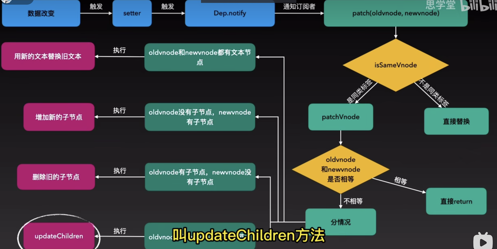
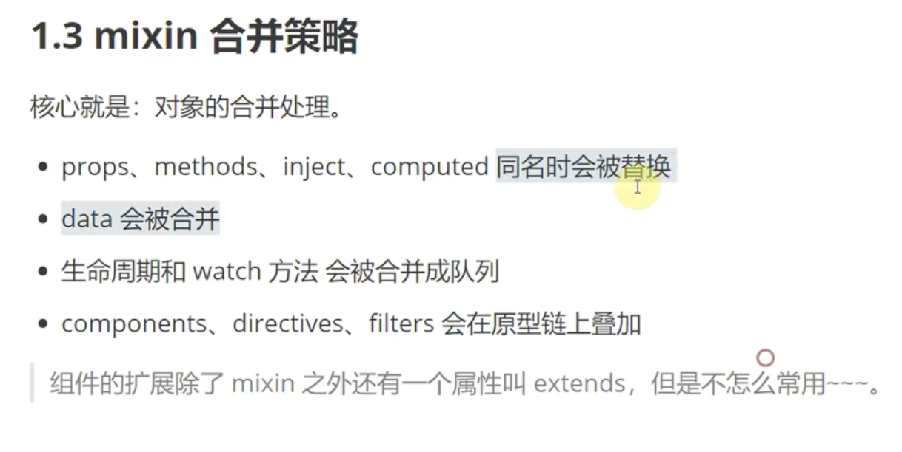
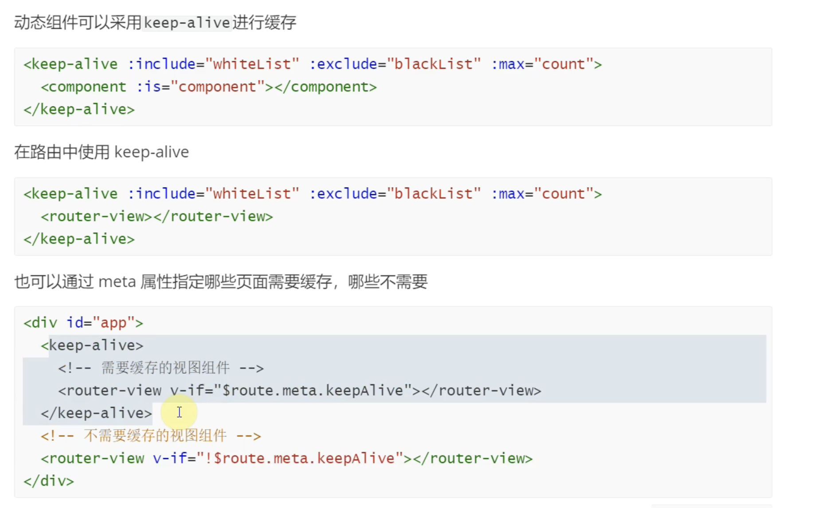
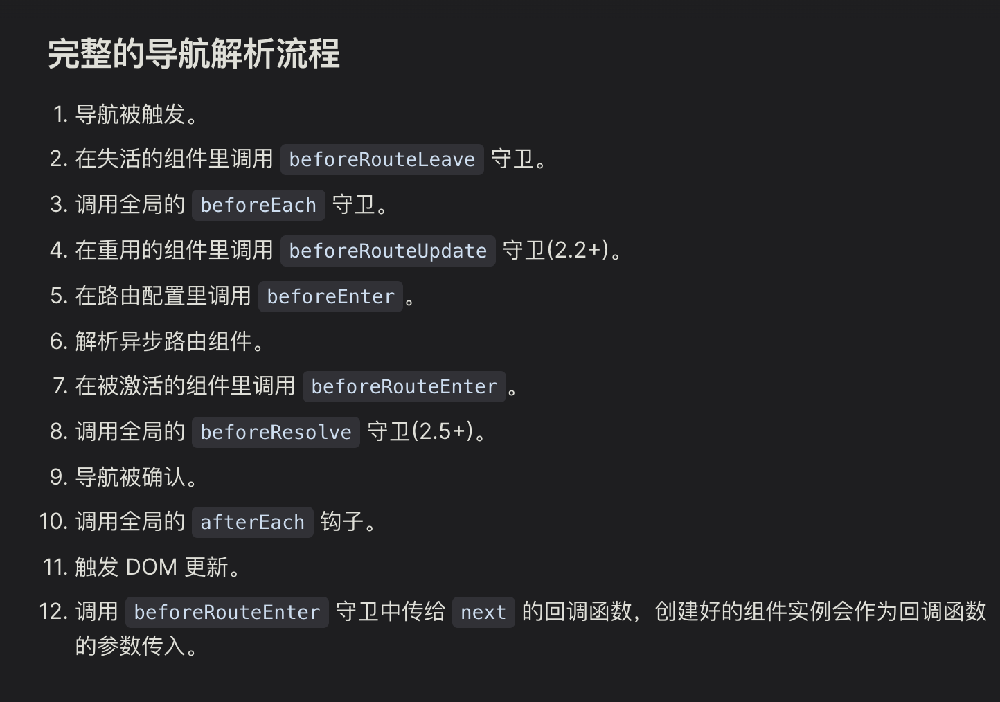

## Vue 的核心

- 渐进式框架
- MVVM
- 声明式渲染 ：使用 HTML 的模版语法，在 HTML 使用 js 表达式，声明式的将数据绑定到 DOM 上
- 响应式：跟踪 js 状态更新 DOM
- 组件化

## MVVM

首先，MVVM 是一种框架设计模式
MVVM 是 Model - View - ViewModle 的缩写
Model 代表数据模型
View 代表视图
ViewModel 通过双向数据绑定，实现 Model 和 View 的交互

补充：
ViewModel 监听到数据改变，更新视图，监听用户操作视图，然后通知数据做改动
这使得开发者只需关注业务逻辑，不需要手动操作 DOM，页不需要关注数据状态的同步问题

## SPA

单页面应用 single page application
实际上只有一个 html 文件，这个 html 文件提供挂载点，浏览器解析执行代码，生成真实的 DOM 渲染到挂载点

缺点：

- 不利于 SEO ，搜索引擎获取不到页面信息  
  --SSR+CSR 服务端渲染，可以只首屏 SSR 渲染 ，vue 的 NustJs；  
  --静态页面预渲染，适合静态页面
- 所有代码都一起渲染，首屏时间较长，相应的渲染完之后，页面之间的切换页面加载很快  
   --可以异步加载

优点：易于维护，用户体验好，服务端压力小

多页应用，每跳到一个页面，都会重新加载一次，不利于用户体验，但是利于 SEO

- 如何减少首屏加载时间
  1. 减少请求资源大小(代码/静态资源体积)
     - 代码压缩
     - 图片压缩
     - webpack 配置 代码分割
     - webpack 配置 抽取公共代码
     - webpack 配置 tree-shaking 摇树优化，去掉无用代码
  2. 减少请求次数
     - 图片合并-雪碧图
     - 小图片转为 base64
  3. 缓存
     - 静态资源缓存
  4. 预加载
  5. 懒加载
     - 路由懒加载
     - 图片懒加载
     - 组件按需加载
  6. 服务端渲染 SSR
  7. 使用 CND

## 虚拟 DOM

虚拟 DOM 是一个对象用来描述 真实 DOM 树
只重新渲染需要更新的 DOM 节点，性能更好

减少真实 dom 的操作
容易实现跨平台

template 编辑模版  
render 函数生成虚拟 DOM  
patch 转换成真实 DOM ，diff 算法对比新旧虚拟 DOM，更新真实 DOM

### diff

深度递归 + 双指针

比较流程：

1. 通过 key 值和标签名比较是否相同节点
2. 是相同节点，比较属性是否相同，相同则仍使用旧节点，不同则更新属性，
3. 比较子节点

   - 旧节点没有子节点，新节点有子节点，新增子节点
   - 旧节点有子节点，新节点没有子节点，删除子节点
   - 新旧节点都有子节点，继续比较子节点
   - 新旧节点都是文本，替换文本

4. 对比子节点用到了双指针算法，新旧节点头尾各一个指针，四种情况，新头和旧头，新尾和旧尾，新头和旧尾，新尾和旧头，
   - 如果四种情况都没有相同的节点，会在用 key 在旧节点的映射表中查找新节点，如果找到则移动到旧节点的头部，如果没有找到则新增节点



Vue3.x 增加最长递增子序列算法，减少了节点的移动

### key 的作用和原理

- key 的作用
  1. 提高 diff 的效率
  2. 保证组件的状态，不被复用
- key 的原理
  1. diff 算法中，通过 key 值和标签名比较是否相同节点
  2. 如果不加 key，标签相同会复用节点，就地更新，如果加了 key，会重新创建节点

## 组件化

组件级更新，降低更新范围

每个组件都会有 渲染函数 watcher、effect，当组件内的数据发生变化时，会通知组件重新渲染

- 如何合理的拆分组件？
  1. 什么情况下拆分
     业务复杂或者代码量过大，可拆分组件，提高可读性和可维护性  
     重复功能，可拆分组件，提高复用性  
     性能优化，可拆分组件，减少不必要的渲染
  2. 拆分原则
     单一职责原则： 每个组件应该只做一件事情。如果一个组件处理了多个任务，那么你应该考虑将其拆分为多个更小的组件。  
     复杂性：如果一个组件变得过于复杂，那么你应该考虑将其拆分为多个更小的组件，每个组件处理一部分功能。  
     数据流：尽量让数据流向单一方向流动，这样可以使得组件之间的依赖关系更清晰，也更容易理解和维护。  
     不要过度拆分： 组件拆分注意不要过度拆分，增加维护成本， 过度拆分导致层级过深，会增加渲染成本，数据传递成本，建议组件嵌套不要超过 5 层

## 响应式

通过数据劫持，监听数据变化，更新视图

- 数据劫持怎么实现
  Vue2.x Object.defineProperty()
  Vue3.x Proxy

- Vue2.x 缺点->为什么要改成用 Proxy 实现的原因：

要重写属性,遍历数据，数据每一个属性增加 set 和 get ，实现数据劫持，但是这种形式性能消耗大一点  
数组也需要遍历，消耗较大，通过重写数组方法增加 set 和 get，数组的方法有 push pop shift unshift splice sort reverse  
但是通过索引修改数组的值，和改变数组 length 不会触发 set 和 get
不支持 Map 和 Set 数据类型

```html
<template>
  <input v-model="value" />
</template>
```

```js
const obj = { name: 'Nick', age: 18 };
let newArrayProperty = Object.create(Array.property);
let oldArrayProperty = Array.property[
  //数组方法劫持
  ('push', 'pop', 'shift', 'unshift', 'splice', 'sort', 'reverse')
].forEach(method => {
  newArrayProperty[method] = function (...arg) {
    oldArrayProperty[method].call(this, ...arg);
    //触发试视图更新
    console.log('数组更新了');
  };
});
//数据劫持
function defineReactive(obj, key, value) {
  Object.defineProperty(obj, key, {
    get() {
      console.log('get', value);
      return value;
    },
    set(newValue) {
      console.log('set', newValue);
      if (value !== newValue) {
        value = newValue;
        observer(newValue); //递归， 如果设置的值是对象，继续劫持
      }
    }
  });
}

//监听器
function observer(data) {
  if (!data || typeof data !== 'object') {
    return;
  }
  if (Array.isArray(data)) {
    //改写数组方法
    data.__proto__ = newArrayProperty;
  }
  Object.keys(data).forEach(key => {
    defineReactive(data, key, data[key]);
  });
}
```

```js
const obj = { name: 'Nick', age: 18, n: [1, 2] };

const handler = {
  get(target, key) {
    console.log('get', key);
    if (typeof target[key] == 'object') {
      return new Proxy(target[key], handler);
    }
    return target[key];
  },
  set(target, key, value) {
    target[key] = value;
  }
};
//不是重写，而是拦截，取值和赋值的时候做一些操作
function reactive(obj) {
  return new Proxy(obj, handler);
}
```

### 如何进行依赖收集

依赖收集：当数据发生变化时，通知依赖数据的视图更新
在 mount 阶段每个组件都会创建一个渲染函数 watcher，
调用 render 函数生成虚拟 DOM 时，会触发响应式数据的 get 方法，get 方法中会收集依赖，将 watcher 放到全局的 dep 中，当数据发生变化，会触发 set 方法，set 方法中会通知 dep 中的 watcher 执行 update 方法，更新视图

数据 和 watcher 是多对多的关系，一个数据可能被多个 watcher 依赖，一个 watcher 也可能依赖多个数据

Vue2.x 和 Vue3.x 是一样的流程

### Vue3.x ref 和 reactive 区别

对象通过 reactive 实现响应式，
new Proxy() 只能代理对象类型 (对象、数组和如 Map、Set 这样的集合类型)
ref 将数据进行包装，返回一个对象，对象中有一个 value 属性，value 属性是响应式的，当 value 属性发生变化时，会通知依赖的视图更新，底层是 Object.defineProperty()实现的

如果将一个对象赋值给 ref，那么这个对象将通过 reactive() 转为具有深层次响应式的对象

reactive 里属性值使用 ref 包装，取值的时候不需要.value
reactive 进行结构或者赋值给变量，会失去响应性，需要使用 toRefs()，将响应式对象转换为普通对象，对象中的每个属性都是 ref 类型

### 双向绑定

核心：`Object.defineProperty` + 发布订阅模式

1. 监听器 Observer，通过`Object.defineProperty`劫持并监听 data 所有属性，如果有变动，就通知订阅者。
2. 订阅者 Watcher，可以收到属性的变化通知并执行相应的函数，从而更新视图。
3. 解析器 Compile，可以扫描和解析每个节点的相关指令，并将相关指令对应初始化成一个订阅者 Watcher。

### v-model

Vue2.x：v-model 默认会利用名为 value 的 prop 和名为 input 的事件

Vue3.x： v-model 默认会利用名为 modelValue 的 prop 和名为 update:modelValue 的事件

- 文本类 input textarea 绑定 value 属性 侦听 input 事件
- checkbox 和 radio 类型 绑定 checked 属性 侦听 change 事件
- select 绑定 value 侦听 change 事件

Vue3.x 可以自定义多个 v-model

对于 input 表单元素，除了编译为 value 和 input ，可能还会有一些额外的逻辑

### Vue2.x 如何监听数组变化

Vue2.x 中实现检测数组变化的方法，是将数组的常用方法进行了重写。Vue 将 data 中的数组进行了原型链重写，指向了自己定义的数组原型方法。这样当调用数组 api 时，可以通知依赖更新。如果数组中包含着引用类型，会对数组中的引用类型再次递归遍历进行监控。这样就实现了监测数组变化

当利用索引直接设置一个数组项时，
当通过 length 属性直接赋值修改数组的长度时
Vue2.x 的方式无法监听到，Vue2.x 解决方法$set、splice

### $set（Vue2.x）

- 为什么要用 $set
  因为 Vue 在初始化实例时对属性执行 getter/setter 转化过程，属性必须在 data 对象上才能让 Vue 转换它，才能让它是响应式的，
  动态添加的属性不是响应式的，所以需要用 $set
- $set 原理
  也是使用 Object.defineProperty() 劫持属性，使其变成响应式的，但是数组会改为使用数组的方法

不可以在$data 上添加属性

Vue3.x 用 Proxy 实现，不需要 $set

## v-if 和 v-show 区别

v-if 优先级高于 v-show  
v-if 会销毁和重建组件，v-show 只是切换 display 属性

## v-for 和 v-if 为什么不能一起用

- Vue2.x
  v-for 优先级高于 v-if, v-if 会在每次循环时都执行，影响性能

- Vue3.x
  v-if 优先级高于 v-for,默认情况会把 v-if 放到外层，只有在 v-if 为 true 时，才会执行 v-for

  ```
  <script>
  const list = [1,2,3]
  </script>

  <ul>
   <li v-for="item in list" v-if="item%2">{{item}}</li>
  </ul>
  ```

  ```
  //以上代码在 Vue3.x 中会报错，相当于以下代码，所以需要用计算属性先过滤，
  //在Vue2.x可以执行但是还是需要用计算属性或filter过滤，
  <ul>
    <template v-if="item%2">
      <li v-for="item in list" >{{item}}</li>
    </template>
  </ul>

  ```

## watch 和 computed 区别

watch 监听数据，数据变化执行回调函数，适合数据变化时，执行异步操作或开销较大的操作
computed 计算属性，根据依赖数据计算得到的值，只有依赖数据发生变化时，才会重新计算

计算属性能实现响应式也是因为用到了 Object.defineProperty()

computed：  
Vue2.x 是由依赖收集渲染 watcher，当依赖数据发生变化时，会通知渲染 watcher 更新视图
Vue3.x 是由 计算属性收集 effect，当计算属性 dirty = true，会通知 effect 更新视图

## watch 和 watchEffect 区别

watchEffect 会立即执行一次，依赖的数据发生变化时，会重新执行
watch 依赖的数据发生变化时，不会立即执行，需要等到回调函数中的数据发生变化时，才会执行

watchEffect 自动追踪依赖，不需要手动指定依赖，watch 需要手动指定依赖

```
watchEffect(()=>{
  console.log('watchEffect',state.count)
})

watch(()=>{
  console.log('watch',state.count)
  return state.count
},(newVal,oldVal)=>{
  console.log('watch',newVal,oldVal)
})
```

## 如何将 template 编译成 render 函数

Vue 有模版编译功能

1. template -> ast【抽象语法树】：pathHtml
2. 对 ast 进行静态标记，标记静态节点，提升性能，不需要每次都重新渲染静态节点，只需要渲染动态节点
3. 通过 ast 生成 render 函数

## new Vue() 发生了什么（Vue2.x）---没懂

总结：new Vue() 进行一些内部初始化操作，初始化绑定事件，初始化组件的父子关系、初始化响应数据，生成 render 函数，挂载 DOM 等
并且划分一系列生命周期，在执行到对应的代码阶段，触发对应的钩子函数

1. 初始化组件绑定的事件，初始化组件的父子关系 $parent $children $root
2. 触发第一个生命周期的钩子 beforeCreate
3. 初始化依赖注入：provide 和 inject，初始化 data、computed 和 watch 等响应式数据
4. 触发 created 钩子
5. 检查用户是否传入 el 和 template 或者 render，如果没有传入，需要调用 vm.$mount()手动挂载
6. 内部挂载的时候会生成的 watcher，调用 render 函数触发依赖收集

runtime-with-compiler.js 是做什么的？？？？什么情况下执行这个文件

### 生命周期钩子

组合式 API ：

钩子的概念：在程序运行中，在特定的位置，通过注册一个回调函数进行相关业务代码的编写

onMounted：
组件完成挂载。同步子组件都已经被挂载，
其自身的 DOM 树已经创建完成并插入了父容器中
可以进行 DOM 操作，更改数据不会触发 onUpdated

onUpdated：
响应式数据更改， DOM 树更新后调用；
父组件的更新钩子将在其子组件的更新钩子之后调用
要注意的是避免在此期间更改数据，因为这可能会导致无限循环的更新。

onUnmounted：
组件实例被卸载后调用；
子组件实例已被卸载，自身创建的计算属性和侦听器都已停止运行
进行定时器、DOM 事件监听器副作用清除操作

onBeforeMount：
在组件实例挂载之前，已完成响应式设置，但 DOM 节点 还没创建

onBeforeUpdate：
响应式状态已改变，还没更新 DOM 树

onBeforeUnmount：
组件卸载之前，组件实例还保有全部功能

> > onErrorCaptured
> > onRenderTracked：开发模式下可用
> > onRenderTriggered：开发模式下可用
> > onActivated：若组件实例是 <KeepAlive> 缓存树的一部分，当组件被插入到 DOM 中时调用。
> > onDeactivated：若组件实例是 <KeepAlive> 缓存树的一部分，当组件从 DOM 中被移除时调用。
> > onServerPrefetch：注册一个异步函数，在组件实例在服务器上被渲染之前调用；仅会在服务端渲染中执行，用于执行一些仅存在于服务端的数据抓取过程

选项式 API

beforeCreate：
组件实例创建之后调用，在当前阶段 data、methods、computed 以及 watch 上的数据和方法都不能被访问。

created：
在实例创建完成后发生，当前阶段已经完成了响应式数据、计算属性、方法和侦听器设置，也就是可以使用数据，更改数据，
在这里更改数据不会触发 updated 函数。
可以做一些初始数据的获取，在当前阶段无法与 DOM 进行交互，如果非要想，可以通过 vm.$nextTick 来访问 DOM 。

beforeMount：发生在组件挂载之前，在这之前 template 模板已导入渲染函数编译。而当前阶段虚拟 DOM 已经创建完成，即将开始渲染。在此时也可以对数据进行更改，不会触发 updated。

mounted：在组件挂载完成后发生，在当前阶段，真实的 DOM 挂载完毕，数据完成双向绑定，可以访问到 DOM 节点，使用 $refs 属性对 DOM 进行操作。

beforeUpdate：发生在 DOM 更新之前，也就是响应式数据发生更新，虚拟 DOM 重新渲染之前被触发，你可以在当前阶段进行更改数据，不会造成重渲染。

updated：发生在更新完成之后，当前阶段组件 DOM 已完成更新。要注意的是避免在此期间更改数据，因为这可能会导致无限循环的更新。

beforeDestroy：发生在实例销毁之前，在当前阶段实例完全可以被使用，可以做一些清除副作用的工作，比如清除计时器。

destroyed：发生在实例销毁之后，这个时候只剩下了 DOM 空壳。组件已被拆解，数据绑定被卸除，监听被移出，子实例也统统被销毁。

ps：  
beforeCreate：编写一些插件时会用到，可以在这个时候进行插件的注册

### 子组件和父组件的生命周期钩子执行顺序，子组件先还是父组件先

组件的调用顺序都是先父后子，渲染完成的顺序是先子后父。组件的销毁操作是先父后子，销毁完成的顺序是先子后父。

加载渲染过程：父 beforeCreate->父 created->父 beforeMount->子 beforeCreate->子 created->子 beforeMount- >子 mounted->父 mounted

子组件更新过程：父 beforeUpdate->子 beforeUpdate->子 updated->父 updated

父组件更新过程：父 beforeUpdate -> 父 updated

销毁过程：父 beforeDestroy->子 beforeDestroy->子 destroyed->父 destroyed

## Vue.observable 做了什么(Vue2.x)

## Vue.use()

对象/函数
对象:内部使用 install 方法
函数:直接执行

## Vue.extend()

生成一个子类
子类的原型会挂载父类（Vue）的方法，并执行 Vue 的 init 方法

子类调用$mount() 挂载在元素上

Vue 在构造组件的时候就会调用 Vue.extend()

- 可以将组件挂载到任意 DOM 节点上
- 可以解析字符串模版

## Vue data 为什么是函数

因为组件是可以复用的，如果 data 是对象，那么组件复用时，data 会被共享，一个组件的数据改变，其他组件的数据也会改变，所以 data 必须是函数，每个组件实例都可以维护一份被返回对象的独立的拷贝

由工厂函数创建，每个组件实例都有自己的数据，防止数据污染

```
const Child = Vue.extends({data:{name:111}})

const child1 = new Child()
```

## 函数组件

没有状态，没有生命周期
组件内设置 functional:true

## filter（Vue2.x）

对数据过滤，而不改变原始数据  
解析后实际上是个纯函数，但是还要解析模版，所以 Vue3.x 中已经废弃,可以自己创建函数实现

## v-once

元素及子节点只渲染一次

提高性能

### v-memo Vue3.x 新增 依赖属性变化重新渲染

## mixin

命名冲突，数据来源问题

全局混入：编写插件
局部混入：复用逻辑

合并策略，同名就近策略



## slot

插槽来源于 Web Components 的一个规范，Vue 2.x 中的插槽是基于这个规范实现的

对组件更好的扩展

- 匿名插槽

  1.  父组件中，子组件标签之间的内容就是传入的内容
  2.  子组件中，通过 slot 标签作为占位符，将父组件传入的内容渲染到占位符

- 具名插槽

1.  父组件中，子组件标签之间，通过 template 标签 v-slot 指令指定插槽名称
2.  子组件中，通过 slot 标签的 name 属性指定插槽名称，slot 标签作为占位符
3.  插槽内容在父组件渲染，子组件渲染的时候替换占位

```
//Parent
<Child>
  //v-slot:header => #header
  <templat v-slot:header>
    <h1>标题</h1>
  </templat>
</Child>

//Child
<div>
 <slot name="title">默认内容</slot>
</div>

```

- 作用域插槽：父组件向子组件传递数据

父级组件 生成函数 在子组件中调用，向函数传递数据，函数返回值替换插槽占为

```vue
//匿名 //Parent
<Child v-slot="slotProps">
  {{ slotProps.text }} {{ slotProps.count }}
</Child>

//Child
<div>
  <slot :text="greetingMessage" :count="1"></slot>
</div>
```

```vue
/*具名*/ /*Parent*/ /*v-slot:name="slotProps" => #title="titleProps"*/
<Child>
  <template #title="titleProps">
    {{ titleProps.text }}
  </template>
</Child>

//Child
<div>
  <slot  name="title" :text="txet" ></slot>
</div>
```

## 修饰符

- .sync（Vue2.x）
Vue2.x 中 绑定多个属性，同步更新，需要手动触发更新
<!-- - .passive
- .camel
  传递的 prop 名称使用驼峰命名，子组件中使用的是短横线命名 -->

1. 表单修饰符

- .lazy
- .number
- .trim

2. 事件修饰符

- .stop
- .prevent
- .capture
- .self
- .once
- .passive
- .native（Vue2.x） 原生事件

3. 鼠标修饰符

- .left
- .right
- .middle

4. 按键修饰符

## 递归组件

菜单/tree

创建组件，给组件命名，方便组件中使用自己

也可以使用 JSX 语法，使用 render 函数

### 给组件写 name 选项的优点

- 递归组件中，可以通过 name 选项，方便组件内部调用自己
- 可以通过 name 选项标识组件，方便调试
- 方便组件的缓存，keep-alive 组件中，可以通过 name 选项，缓存指定组件

## 异步组件

使用工厂函数，返回一个 Promise 对象，resolve 一个组件对象

```JS
//Promise写法

{
  components:{
    Child:()=>import(/*webpackChunkName:"B4"*/'./Child.vue')
  }
}
```

```JS
//对象写法
{
  components:{
    Child:{
      component:()=>import(/*webpackChunkName:"B4"*/'./Child.vue'),
      loading:LoadingComponent,
      error:ErrorComponent,
      delay:200,
      timeout:3000
    }
  }
}
```

1. 默认渲染占位符节点
2. 异步组件加载完成后强制更新， 重新渲染

### nextTick 的作用是什么？原理是什么？

概念：

nextTick 是在更新 DOM 后执行的回调函数  
首先 Vue 的更新是异步的，不会立即执行更新 DOM，而是在下一个事件循环周期中执行更新，nextTick 就是在下一个事件循环周期中执行的回调函数

作用：

- 数据同步修改，视图是异步更新的，如果想要获取更新后的 DOM，需要在 nextTick 回调函数中获取
- 数据多次修改，nextTick 会合并成一次更新，减少 DOM 操作，提高性能

原理：

- nextTick 的原理是 Vue 的异步更新机制和事件循环，

- 实现异步
  Vue2.x 实现异步 通过 Promise.resolve().then() 或者 MutationObserver 或者 setImmediate（IE） 或者 setTimeout  
   Vue3.x 不考虑兼容性，直接使用 Promise.resolve().then()

- Vue 的异步更新机制

1. 依赖跟踪：当你访问一个响应式属性时，Vue.js 会将当前的组件添加到这个属性的依赖列表中。这意味着，当这个属性改变时，Vue.js 知道需要重新渲染哪些组件。

2. 异步更新队列：当你改变一个响应式属性时，Vue.js 不会立即更新 DOM，而是将这个组件标记为“待更新”，然后将其添加到一个异步队列中。

3. 下一个事件循环“tick”：Vue.js 使用了一个内部的异步队列，这个队列在 JavaScript 的事件循环的下一个“tick”中被处理。在这个“tick”中，Vue.js 会遍历异步队列，对每个待更新的组件进行重新渲染和更新 DOM。

你可以使用 `Vue.nextTick(callback)` 方法来在 DOM 更新后执行回调函数。这在你需要在 DOM 更新后进行操作（例如获取更新后的 DOM 元素的尺寸）时非常有用。

## keep-alive

缓存组件实例，不会销毁组件，只是隐藏组件，可以通过 include 和 exclude 属性，指定缓存的组件

1. 使用场景
   

2. 原理
   存成一个对象，key 是组件的 name，value 是组件的 vnode，当组件被激活时，从缓存中取出 vnode，渲染到页面中

   组件会被标记为已缓存，不会被销毁，当组件被激活时，会触发 activated 钩子函数，当组件被停用时，会触发 deactivated 钩子函数

## 自定义指令

可以复用操作 dom 的逻辑

1. 指令的生命周期

- bind
- inserted
- update
- componentUpdated
- unbind

2. 可应用场景

- 防抖
- 图片懒加载
- 权限控制
- 拖拽等

## Vue 如何提升性能

- 使用 computed
- 合理使用 v-if 和 v-show
- 使用 key
- 使用异步组件
- 缓存页面使用 keep-alive
- 控制组件层级

- 通过 Object.freeze()冻结数据，不会被响应式系统追踪，减少依赖收集和触发更新
- 控制组件粒度，减少组件的更新范围

## Vue 中用到的设计模式

- 单例模式
- 工厂模式
- 发布订阅模式
- 观察者模式
- 代理模式
- 装饰器模式

## Vue3 比 Vue2 的更新

1.  响应式实现方式，Object.defineProperty 改为 Proxy
2.  增加组合式 API
3.  生命周期 beforeDestroy 改为 beforeUnmount,destroyed 改为 unmounted,  
    组合式 API 没有 beforeCreate 和 created 生命周期，在 setup 函数中调用可以实现相同的功能
4.  删除了过滤器
5.  改变 v-for 和 v-if 的优先级，改为 v-if 优先级比 v-for 高
6.  减小代码体积，tree-shaking，只打包使用到的代码
7.  增加静态标记，标记静态节点，diff 算法时，只对动态节点进行比较
8.  Teleport 组件：它可以将一个组件内部的一部分模板“传送”到该组件的 DOM 结构外层的位置去。比如模态框
9.  Fragments 片段，支持多个根结点
10. ？？？Emits 组件选项\*\*
11. style 标签支持使用 v-bind CSS 函数将 CSS 的值链接到动态的组件状态
12. style scoped 新增全局规则和针对插槽内容的规则

```
<style scoped>
   // deep selectors
   ::v-deep(.foo) {}
   // shorthand
   :deep(.foo) {}
  //targeting slot content
   ::v-slotted(.foo) {}
   //shorthand
   :slotted(.foo) {}
  //one-off global rul
   ::v-global(.foo) {}
   //shorthand
   :global(.foo) {}
</style>
```

### 组合式 API 和选项式 API 区别

选项式 API：组件实例提供了一系列的选项如 methd，computed，watch 来实现组件的逻辑， this 指向当前组件实例，
组合式 API：不需要考虑 this 指向，逻辑更好的复用，灵活的代码组织

- 对比：
  选项式 API 代码逻辑比较分散，组合式 API 代码高聚合，低耦合，逻辑清晰便于维护
  选项式 API 要用 this 访问属性，组合式 API 不需要
  组合式 API 可以更好的利用编辑器的类型推断，便于代码重用
  组合式 API 可以更好的支持 TypeScript
  抽取逻辑,选项式 API 需要用 mixins，组合式 API 可以直接抽取逻辑到函数中或者创建钩子函数
  组合式 API 对 tree-shaking 更友好，选项式 API 会将所有的选项都打包到代码中，组合式 API 只会打包使用到的代码

  mixin 命名必须是唯一的不可重复
  组合函数没有这个问题

### setup 什么时候执行

setup() 钩子会在所有选项式 API 钩子之前调用，包括 beforeCreate

### 路由 Hash 和 History 原理

- hash 模式：
  原理：hashChange 事件/popstate，监听 hash 值的变化，根据 hash 值的变化，来渲染对应的组件

  缺点：后端获取不到不利于 SEO；url 中有 #，不美观
  ps：hash 模式不会向后端发送请求，而是请求`#`前的资源

- history 模式：
  原理：监听 history.pushState()，history.replaceState()，history.popState() 事件，根据当前的 url 渲染对应的组件
  缺点：会向后端发送请求，后端需要配置，否则刷新的时候会出现 404
  ps：history 模式会向后端发起请求，因此需要后端对应的处理逻辑才能返回正确的资源

popstate - 监听浏览器前进后退事件
更改路由是否重新渲染

- abstract

### 路由导航守卫

全局路由
beforeEach：全局前置守卫
beforeResolve：全局解析守卫
afterEach：全局后置守卫
路由配置守卫
beforeEnter：路由独享守卫
组件内守卫
beforeRouteEnter：路由进入前守卫
beforeRouteUpdate：路由更新前守卫
beforeRouteLeave：路由离开前守卫



### VueX

专为 Vue 提供的状态管理器，VueX 的数据是全局可以访问，
复杂的组件间的通讯
store：存储状态 state
改变数据需要调用 commit 方法触发 mutation，mutation 是同步的
如果想要添加异步逻辑，可以通过调用 dispatch 方法，触发 action，action 可以包含任意异步操作，但是还是要通过 commit 方法触发 mutation 改变 state
getter 相当于计算属性，可以对 state 进行处理，返回新的数据

- 如何监听 VueX 数据变化，

1. 可以使用 watch，
2. 使用 store.subscribe -多用于插件

- 如何解决刷新 VueX 数据丢失：

1. 重新调接口获取
2. 存在本地，localStorage，刷新时从本地取 -- 可以写成插件

- VueX module
  数据比较复杂
  namespace

缺点：

1. VueX 只有一个 store，复杂的数据需要依赖于模块拆分
2. 模块和状态命名冲突

Pinia：Vue3.x 的状态管理器，使用了 Vue3.x 的响应式系统，可以创建多个 store，每个 store 都是独立的，可以通过 provide/inject 在组件中使用

### Vue 中的错误怎么处理的

errorCaptured 钩子函数，可以捕获子组件的错误，不会影响父组件的渲染

Vue.config.errorHandler 全局错误处理函数，可以捕获所有组件的错误，不会影响其他组件的渲染

接口错误处理可以在响应拦截器中处理

### Vue3.x PatchFlag

Block 收集动态节点，只对比动态节点
动态节点 标记动态节点的类型，比如文本节点，属性节点，事件节点等

BlockTree

### Vue2.x->Vue3.x 迁移

需要注意，使用的组件库如 Elemen UI 对 Vue3.x 的支持
对 IE 的支持
